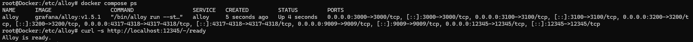

# Grafana Alloy & OpenTelemetry

# 1. Fondamentaux

## Exercice 1 :

code config.alloy:

```jsx
otelcol.receiver.otlp "local" {
  grpc {
    endpoint = "0.0.0.0:4317"
  }
  http {
    endpoint = "0.0.0.0:4318"
  }

  output {
    metrics = [otelcol.exporter.debug.console.input]
    logs    = [otelcol.exporter.debug.console.input]
    traces  = [otelcol.exporter.debug.console.input]
  }
}

otelcol.exporter.debug "console" {
  verbosity = "detailed"
}
```

code docker-compose.yml :

```yaml
services:
  alloy:
    image: grafana/alloy:v1.5.1
    container_name: alloy
    volumes:
      - ./config.alloy:/etc/alloy/config.alloy:ro
    ports:
      - "12345:12345" # UI de débogage
      - "4317:4317"   # OTLP gRPC
      - "4318:4318"   # OTLP HTTP
      - "3000:3000"   # Réservés pour le futur
      - "9009:9009"
      - "3100:3100"
      - "3200:3200"
    command: [
      "run",
      "--stability.level=experimental",
      "--server.http.listen-addr=0.0.0.0:12345",
      "/etc/alloy/config.alloy"
    ]
    restart: unless-stopped
```




## Exercice 2 :

code docker-compose.yml :

```yaml
services:
  alloy:
    image: grafana/alloy:v1.5.1
    container_name: alloy
    volumes:
      - ./config.alloy:/etc/alloy/config.alloy:ro
    ports:
      - "12345:12345"
      - "4317:4317"
      - "4318:4318"
      - "3000:3000"
      - "9009:9009"
      - "3100:3100"
      - "3200:3200"
    command: [
      "run",
      "--stability.level=experimental", # <-- La ligne vitale qui manquait
      "--server.http.listen-addr=0.0.0.0:12345",
      "/etc/alloy/config.alloy"
    ]
    restart: unless-stopped

  telemetrygen:
    image: ghcr.io/open-telemetry/opentelemetry-collector-contrib/telemetrygen:latest
    profiles: ["tools"]
    entrypoint: ["/telemetrygen"]
   
```

Lancement des trois commandes :

```bash
# 1. Envoi de 5 traces distinctes
docker compose run --rm telemetrygen traces --otlp-endpoint alloy:4317 --otlp-insecure --traces 5

# 2. Envoi de métriques pendant 10 secondes
docker compose run --rm telemetrygen metrics --otlp-endpoint alloy:4317 --otlp-insecure --duration 10s

# 3. Envoi de logs pendant 5 secondes
docker compose run --rm telemetrygen logs --otlp-endpoint alloy:4317 --otlp-insecure --duration 5s
```

quand je fait la commande : 

```bash
docker compose logs alloy | grep -E "ResourceSpans|ResourceMetrics|ResourceLogs" | head
```

j’ai ce résultat:

```bash
alloy  | ts=2026-06-10T12:02:01.306482765Z level=info msg="ResourceSpans #0\nResource SchemaURL: https://opentelemetry.io/schemas/1.40.0\nResource attributes:\n     -> service.name: Str(telemetrygen)\nScopeSpans #0\nScopeSpans SchemaURL: \nInstrumentationScope telemetrygen \nSpan #0\n    Trace ID       : 9d31018bc9a948d1ee813e2580d93b23\n    Parent ID      : 8b49dce31fe81d11\n    ID             : e2d92745c894eaff\n    Name           : okey-dokey-0\n    Kind           : Server\n    Start time     : 2026-06-10 12:01:59.261663974 +0000 UTC\n    End time       : 2026-06-10 12:01:59.261786974 +0000 UTC\n    Status code    : Unset\n    Status message : \nAttributes:\n     -> network.peer.address: Str(1.2.3.4)\n     -> service.peer.name: Str(telemetrygen-client)\nSpan #1\n    Trace ID       : 9d31018bc9a948d1ee813e2580d93b23\n    Parent ID      : \n    ID             : 8b49dce31fe81d11\n    Name           : lets-go\n    Kind           : Client\n    Start time     : 2026-06-10 12:01:59.261663974 +0000 UTC\n    End time       : 2026-06-10 12:01:59.261786974 +0000 UTC\n    Status code    : Unset\n    Status message : \nAttributes:\n     -> network.peer.address: Str(1.2.3.4)\n     -> service.peer.name: Str(telemetrygen-server)\n" component_path=/ component_id=otelcol.exporter.debug.console
alloy  | ts=2026-06-10T12:02:02.270332256Z level=info msg="ResourceSpans #0\nResource SchemaURL: https://opentelemetry.io/schemas/1.40.0\nResource attributes:\n     -> service.name: Str(telemetrygen)\nScopeSpans #0\nScopeSpans SchemaURL: \nInstrumentationScope telemetrygen \nSpan #0\n    Trace ID       : f3679c4c032fb23eed827d815bbfb276\n    Parent ID      : 762d82d60571bf37\n    ID             : 1580e93c3fedc7fa\n    Name           : okey-dokey-0\n    Kind           : Server\n    Start time     : 2026-06-10 12:02:00.263364248 +0000 UTC\n    End time       : 2026-06-10 12:02:00.263487248 +0000 UTC\n    Status code    : Unset\n    Status message : \nAttributes:\n     -> network.peer.address: Str(1.2.3.4)\n     -> service.peer.name: Str(telemetrygen-client)\nSpan #1\n    Trace ID       : f3679c4c032fb23eed827d815bbfb276\n    Parent ID      : \n    ID             : 762d82d60571bf37\n    Name           : lets-go\n    Kind           : Client\n    Start time     : 2026-06-10 12:02:00.263364248 +0000 UTC\n    End time       : 2026-06-10 12:02:00.263487248 +0000 UTC\n    Status code    : Unset\n    Status message : \nAttributes:\n     -> network.peer.address: Str(1.2.3.4)\n     -> service.peer.name: Str(telemetrygen-server)\n" component_path=/ component_id=otelcol.exporter.debug.console
alloy  | ts=2026-06-10T12:02:04.268654579Z level=info msg="ResourceSpans #0\nResource SchemaURL: https://opentelemetry.io/schemas/1.40.0\nResource attributes:\n     -> service.name: Str(telemetrygen)\nScopeSpans #0\nScopeSpans SchemaURL: \nInstrumentationScope telemetrygen \nSpan #0\n    Trace ID       : e7ff86e86a8f73d69e3d02fb373349d1\n    Parent ID      : 6d9af44832be74af\n    ID             : 5854e16f37880e1c\n    Name           : okey-dokey-0\n    Kind           : Server\n    Start time     : 2026-06-10 12:02:02.262395964 +0000 UTC\n    End time       : 2026-06-10 12:02:02.262518964 +0000 UTC\n    Status code    : Unset\n    Status message : \nAttributes:\n     -> network.peer.address: Str(1.2.3.4)\n     -> service.peer.name: Str(telemetrygen-client)\nSpan #1\n    Trace ID       : e7ff86e86a8f73d69e3d02fb373349d1\n    Parent ID      : \n    ID             : 6d9af44832be74af\n    Name           : lets-go\n    Kind           : Client\n    Start time     : 2026-06-10 12:02:02.262395964 +0000 UTC\n    End time       : 2026-06-10 12:02:02.262518964 +0000 UTC\n    Status code    : Unset\n    Status message : \nAttributes:\n     -> network.peer.address: Str(1.2.3.4)\n     -> service.peer.name: Str(telemetrygen-server)\n" component_path=/ component_id=otelcol.exporter.debug.console
alloy  | ts=2026-06-10T12:02:06.270276366Z level=info msg="ResourceSpans #0\nResource SchemaURL: https://opentelemetry.io/schemas/1.40.0\nResource attributes:\n     -> service.name: Str(telemetrygen)\nScopeSpans #0\nScopeSpans SchemaURL: \nInstrumentationScope telemetrygen \nSpan #0\n    Trace ID       : b333f3268b92112de56bce09c16386d0\n    Parent ID      : f75a1157d711d092\n    ID             : 74fa0173e163392b\n    Name           : okey-dokey-0\n    Kind           : Server\n    Start time     : 2026-06-10 12:02:04.263716834 +0000 UTC\n    End time       : 2026-06-10 12:02:04.263839834 +0000 UTC\n    Status code    : Unset\n    Status message : \nAttributes:\n     -> network.peer.address: Str(1.2.3.4)\n     -> service.peer.name: Str(telemetrygen-client)\nSpan #1\n    Trace ID       : b333f3268b92112de56bce09c16386d0\n    Parent ID      : \n    ID             : f75a1157d711d092\n    Name           : lets-go\n    Kind           : Client\n    Start time     : 2026-06-10 12:02:04.263716834 +0000 UTC\n    End time       : 2026-06-10 12:02:04.263839834 +0000 UTC\n    Status code    : Unset\n    Status message : \nAttributes:\n     -> network.peer.address: Str(1.2.3.4)\n     -> service.peer.name: Str(telemetrygen-server)\n" component_path=/ component_id=otelcol.exporter.debug.console
alloy  | ts=2026-06-10T12:02:08.266209713Z level=info msg="ResourceSpans #0\nResource SchemaURL: https://opentelemetry.io/schemas/1.40.0\nResource attributes:\n     -> service.name: Str(telemetrygen)\nScopeSpans #0\nScopeSpans SchemaURL: \nInstrumentationScope telemetrygen \nSpan #0\n    Trace ID       : 5dbb0a3c5cae9f005fb44876a2ff6dbb\n    Parent ID      : c96d4e40429a87b3\n    ID             : bbc6c4f9a8ed206b\n    Name           : okey-dokey-0\n    Kind           : Server\n    Start time     : 2026-06-10 12:02:06.262384859 +0000 UTC\n    End time       : 2026-06-10 12:02:06.262507859 +0000 UTC\n    Status code    : Unset\n    Status message : \nAttributes:\n     -> network.peer.address: Str(1.2.3.4)\n     -> service.peer.name: Str(telemetrygen-client)\nSpan #1\n    Trace ID       : 5dbb0a3c5cae9f005fb44876a2ff6dbb\n    Parent ID      : \n    ID             : c96d4e40429a87b3\n    Name           : lets-go\n    Kind           : Client\n    Start time     : 2026-06-10 12:02:06.262384859 +0000 UTC\n    End time       : 2026-06-10 12:02:06.262507859 +0000 UTC\n    Status code    : Unset\n    Status message : \nAttributes:\n     -> network.peer.address: Str(1.2.3.4)\n     -> service.peer.name: Str(telemetrygen-server)\n" component_path=/ component_id=otelcol.exporter.debug.console
alloy  | ts=2026-06-10T12:02:25.822853644Z level=info msg="ResourceMetrics #0\nResource SchemaURL: https://opentelemetry.io/schemas/1.40.0\nResource attributes:\n     -> service.name: Str(telemetrygen)\nScopeMetrics #0\nScopeMetrics SchemaURL: \nInstrumentationScope  \nMetric #0\nDescriptor:\n     -> Name: gen\n     -> Description: \n     -> Unit: \n     -> DataType: Gauge\nNumberDataPoints #0\nStartTimestamp: 1970-01-01 00:00:00 +0000 UTC\nTimestamp: 2026-06-10 12:02:14.780384032 +0000 UTC\nValue: 0\nScopeMetrics #1\nScopeMetrics SchemaURL: \nInstrumentationScope  \nMetric #0\nDescriptor:\n     -> Name: gen\n     -> Description: \n     -> Unit: \n     -> DataType: Gauge\nNumberDataPoints #0\nStartTimestamp: 1970-01-01 00:00:00 +0000 UTC\nTimestamp: 2026-06-10 12:02:14.780386862 +0000 UTC\nValue: 1\nScopeMetrics #2\nScopeMetrics SchemaURL: \nInstrumentationScope  \nMetric #0\nDescriptor:\n     -> Name: gen\n     -> Description: \n     -> Unit: \n     -> DataType: Gauge\nNumberDataPoints #0\nStartTimestamp: 1970-01-01 00:00:00 +0000 UTC\nTimestamp: 2026-06-10 12:02:15.781164511 +0000 UTC\nValue: 2\nScopeMetrics #3\nScopeMetrics SchemaURL: \nInstrumentationScope  \nMetric #0\nDescriptor:\n     -> Name: gen\n     -> Description: \n     -> Unit: \n     -> DataType: Gauge\nNumberDataPoints #0\nStartTimestamp: 1970-01-01 00:00:00 +0000 UTC\nTimestamp: 2026-06-10 12:02:16.78166186 +0000 UTC\nValue: 3\nScopeMetrics #4\nScopeMetrics SchemaURL: \nInstrumentationScope  \nMetric #0\nDescriptor:\n     -> Name: gen\n     -> Description: \n     -> Unit: \n     -> DataType: Gauge\nNumberDataPoints #0\nStartTimestamp: 1970-01-01 00:00:00 +0000 UTC\nTimestamp: 2026-06-10 12:02:17.781172973 +0000 UTC\nValue: 4\nScopeMetrics #5\nScopeMetrics SchemaURL: \nInstrumentationScope  \nMetric #0\nDescriptor:\n     -> Name: gen\n     -> Description: \n     -> Unit: \n     -> DataType: Gauge\nNumberDataPoints #0\nStartTimestamp: 1970-01-01 00:00:00 +0000 UTC\nTimestamp: 2026-06-10 12:02:18.781406103 +0000 UTC\nValue: 5\nScopeMetrics #6\nScopeMetrics SchemaURL: \nInstrumentationScope  \nMetric #0\nDescriptor:\n     -> Name: gen\n     -> Description: \n     -> Unit: \n     -> DataType: Gauge\nNumberDataPoints #0\nStartTimestamp: 1970-01-01 00:00:00 +0000 UTC\nTimestamp: 2026-06-10 12:02:19.780765466 +0000 UTC\nValue: 6\nScopeMetrics #7\nScopeMetrics SchemaURL: \nInstrumentationScope  \nMetric #0\nDescriptor:\n     -> Name: gen\n     -> Description: \n     -> Unit: \n     -> DataType: Gauge\nNumberDataPoints #0\nStartTimestamp: 1970-01-01 00:00:00 +0000 UTC\nTimestamp: 2026-06-10 12:02:20.781695306 +0000 UTC\nValue: 7\nScopeMetrics #8\nScopeMetrics SchemaURL: \nInstrumentationScope  \nMetric #0\nDescriptor:\n     -> Name: gen\n     -> Description: \n     -> Unit: \n     -> DataType: Gauge\nNumberDataPoints #0\nStartTimestamp: 1970-01-01 00:00:00 +0000 UTC\nTimestamp: 2026-06-10 12:02:21.781125466 +0000 UTC\nValue: 8\nScopeMetrics #9\nScopeMetrics SchemaURL: \nInstrumentationScope  \nMetric #0\nDescriptor:\n     -> Name: gen\n     -> Description: \n     -> Unit: \n     -> DataType: Gauge\nNumberDataPoints #0\nStartTimestamp: 1970-01-01 00:00:00 +0000 UTC\nTimestamp: 2026-06-10 12:02:22.78227988 +0000 UTC\nValue: 9\nScopeMetrics #10\nScopeMetrics SchemaURL: \nInstrumentationScope  \nMetric #0\nDescriptor:\n     -> Name: gen\n     -> Description: \n     -> Unit: \n     -> DataType: Gauge\nNumberDataPoints #0\nStartTimestamp: 1970-01-01 00:00:00 +0000 UTC\nTimestamp: 2026-06-10 12:02:23.782276179 +0000 UTC\nValue: 10\nScopeMetrics #11\nScopeMetrics SchemaURL: \nInstrumentationScope  \nMetric #0\nDescriptor:\n     -> Name: gen\n     -> Description: \n     -> Unit: \n     -> DataType: Gauge\nNumberDataPoints #0\nStartTimestamp: 1970-01-01 00:00:00 +0000 UTC\nTimestamp: 2026-06-10 12:02:24.781164265 +0000 UTC\nValue: 11\n" component_path=/ component_id=otelcol.exporter.debug.console
```

## Exercice 3

Création de App.py

```bash
import random
import time
from flask import Flask

app = Flask(__name__)

@app.route('/')
def home():
    # Simulation d'une latence variable inférieure à 500ms
    delay = random.uniform(0.01, 0.5)
    time.sleep(delay)
    
    # Simulation de 10% d'erreurs HTTP 500
    if random.random() < 0.10:
        return "Internal Server Error", 500
        
    return "OK", 200

if __name__ == '__main__':
    # Écoute sur toutes les interfaces pour Docker
    app.run(host='0.0.0.0', port=5000)
```

Création de Dockerfile:

```bash
FROM python:3.11-slim

WORKDIR /app

COPY app.py .

# Installation de Flask et des outils OpenTelemetry
RUN pip install --no-cache-dir flask opentelemetry-distro opentelemetry-exporter-otlp

# Installation des dépendances spécifiques d'instrumentation (ici pour Flask)
RUN opentelemetry-bootstrap -a install

# Commande d'exécution via le wrapper OpenTelemetry
CMD ["opentelemetry-instrument", "python", "app.py"]
```

Ajout de l’App dans Docker-compose.yml

```yaml
services:
  alloy:
    image: grafana/alloy:v1.5.1
    container_name: alloy
    volumes:
      - ./config.alloy:/etc/alloy/config.alloy:ro
    ports:
      - "12345:12345"
      - "4317:4317"
      - "4318:4318"
      - "3000:3000"
      - "9009:9009"
      - "3100:3100"
      - "3200:3200"
    command: [
      "run",
      "--stability.level=experimental", # <-- La ligne vitale qui manquait
      "--server.http.listen-addr=0.0.0.0:12345",
      "/etc/alloy/config.alloy"
    ]
    restart: unless-stopped

  flask-app:
      build: .
      container_name: flask-app
      ports:
        - "5000:5000"
      environment:
        - OTEL_SERVICE_NAME=demo
        # On cible le port HTTP OTLP d'Alloy
        - OTEL_EXPORTER_OTLP_ENDPOINT=http://alloy:4318
        - OTEL_EXPORTER_OTLP_PROTOCOL=http/protobuf
        # On force l'export des 3 signaux en OTLP
        - OTEL_TRACES_EXPORTER=otlp
        - OTEL_METRICS_EXPORTER=otlp
        - OTEL_LOGS_EXPORTER=otlp
      depends_on:
        - alloy
```

Générez 30 requêtes HTTP sur l'application :

```bash
**for i in $(seq 1 30); do curl -s http://localhost:5000/ >/dev/null; done**
```

Vérifiez ensuite dans les logs d'Alloy que les données de l'application `demo` remontent :

```bash
docker compose logs alloy --tail=300 | grep -E "service.name|GET /"

alloy  | ts=2026-06-10T12:02:01.306482765Z level=info msg="ResourceSpans #0\nResource SchemaURL: https://opentelemetry.io/schemas/1.40.0\nResource attributes:\n     -> service.name: Str(telemetrygen)\nScopeSpans #0\nScopeSpans SchemaURL: \nInstrumentationScope telemetrygen \nSpan #0\n    Trace ID       : 9d31018bc9a948d1ee813e2580d93b23\n    Parent ID      : 8b49dce31fe81d11\n    ID             : e2d92745c894eaff\n    Name           : okey-dokey-0\n    Kind           : Server\n    Start time     : 2026-06-10 12:01:59.261663974 +0000 UTC\n    End time       : 2026-06-10 12:01:59.261786974 +0000 UTC\n    Status code    : Unset\n    Status message : \nAttributes:\n     -> network.peer.address: Str(1.2.3.4)\n     -> service.peer.name: Str(telemetrygen-client)\nSpan #1\n    Trace ID       : 9d31018bc9a948d1ee813e2580d93b23\n    Parent ID      : \n    ID             : 8b49dce31fe81d11\n    Name           : lets-go\n    Kind           : Client\n    Start time     : 2026-06-10 12:01:59.261663974 +0000 UTC\n    End time       : 2026-06-10 12:01:59.261786974 +0000 UTC\n    Status code    : Unset\n    Status message : \nAttributes:\n     -> network.peer.address: Str(1.2.3.4)\n     -> service.peer.name: Str(telemetrygen-server)\n" component_path=/ component_id=otelcol.exporter.debug.console
alloy  | ts=2026-06-10T12:02:02.270332256Z level=info msg="ResourceSpans #0\nResource SchemaURL: https://opentelemetry.io/schemas/1.40.0\nResource attributes:\n     -> service.name: Str(telemetrygen)\nScopeSpans #0\nScopeSpans SchemaURL: \nInstrumentationScope telemetrygen \nSpan #0\n    Trace ID       : f3679c4c032fb23eed827d815bbfb276\n    Parent ID      : 762d82d60571bf37\n    ID             : 1580e93c3fedc7fa\n    Name           : okey-dokey-0\n    Kind           : Server\n    Start time     : 2026-06-10 12:02:00.263364248 +0000 UTC\n    End time       : 2026-06-10 12:02:00.263487248 +0000 UTC\n    Status code    : Unset\n    Status message : \nAttributes:\n     -> network.peer.address: Str(1.2.3.4)\n     -> service.peer.name: Str(telemetrygen-client)\nSpan #1\n    Trace ID       : f3679c4c032fb23eed827d815bbfb276\n    Parent ID      : \n    ID             : 762d82d60571bf37\n    Name           : lets-go\n    Kind           : Client\n    Start time     : 2026-06-10 12:02:00.263364248 +0000 UTC\n    End time       : 2026-06-10 12:02:00.263487248 +0000 UTC\n    Status code    : Unset\n    Status message : \nAttributes:\n     -> network.peer.address: Str(1.2.3.4)\n     -> service.peer.name: Str(telemetrygen-server)\n" component_path=/ component_id=otelcol.exporter.debug.console
alloy  | ts=2026-06-10T12:02:04.268654579Z level=info msg="ResourceSpans #0\nResource SchemaURL: https://opentelemetry.io/schemas/1.40.0\nResource attributes:\n     -> service.name: Str(telemetrygen)\nScopeSpans #0\nScopeSpans SchemaURL: \nInstrumentationScope telemetrygen \nSpan #0\n    Trace ID       : e7ff86e86a8f73d69e3d02fb373349d1\n    Parent ID      : 6d9af44832be74af\n    ID             : 5854e16f37880e1c\n    Name           : okey-dokey-0\n    Kind           : Server\n    Start time     : 2026-06-10 12:02:02.262395964 +0000 UTC\n    End time       : 2026-06-10 12:02:02.262518964 +0000 UTC\n    Status code    : Unset\n    Status message : \nAttributes:\n     -> network.peer.address: Str(1.2.3.4)\n     -> service.peer.name: Str(telemetrygen-client)\nSpan #1\n    Trace ID       : e7ff86e86a8f73d69e3d02fb373349d1\n    Parent ID      : \n    ID             : 6d9af44832be74af\n    Name           : lets-go\n    Kind           : Client\n    Start time     : 2026-06-10 12:02:02.262395964 +0000 UTC\n    End time       : 2026-06-10 12:02:02.262518964 +0000 UTC\n    Status code    : Unset\n    Status message : \nAttributes:\n     -> network.peer.address: Str(1.2.3.4)\n     -> service.peer.name: Str(telemetrygen-server)\n" component_path=/ component_id=otelcol.exporter.debug.console
alloy  | ts=2026-06-10T12:02:06.270276366Z level=info msg="ResourceSpans #0\nResource SchemaURL: https://opentelemetry.io/schemas/1.40.0\nResource attributes:\n     -> service.name: Str(telemetrygen)\nScopeSpans #0\nScopeSpans SchemaURL: \nInstrumentationScope telemetrygen \nSpan #0\n    Trace ID       : b333f3268b92112de56bce09c16386d0\n    Parent ID      : f75a1157d711d092\n    ID             : 74fa0173e163392b\n    Name           : okey-dokey-0\n    Kind           : Server\n    Start time     : 2026-06-10 12:02:04.263716834 +0000 UTC\n    End time       : 2026-06-10 12:02:04.263839834 +0000 UTC\n    Status code    : Unset\n    Status message : \nAttributes:\n     -> network.peer.address: Str(1.2.3.4)\n     -> service.peer.name: Str(telemetrygen-client)\nSpan #1\n    Trace ID       : b333f3268b92112de56bce09c16386d0\n    Parent ID      : \n    ID             : f75a1157d711d092\n    Name           : lets-go\n    Kind           : Client\n    Start time     : 2026-06-10 12:02:04.263716834 +0000 UTC\n    End time       : 2026-06-10 12:02:04.263839834 +0000 UTC\n    Status code    : Unset\n    Status message : \nAttributes:\n     -> network.peer.address: Str(1.2.3.4)\n     -> service.peer.name: Str(telemetrygen-server)\n" component_path=/ component_id=otelcol.exporter.debug.console
alloy  | ts=2026-06-10T12:02:08.266209713Z level=info msg="ResourceSpans #0\nResource SchemaURL: https://opentelemetry.io/schemas/1.40.0\nResource attributes:\n     -> service.name: Str(telemetrygen)\nScopeSpans #0\nScopeSpans SchemaURL: \nInstrumentationScope telemetrygen \nSpan #0\n    Trace ID       : 5dbb0a3c5cae9f005fb44876a2ff6dbb\n    Parent ID      : c96d4e40429a87b3\n    ID             : bbc6c4f9a8ed206b\n    Name           : okey-dokey-0\n    Kind           : Server\n    Start time     : 2026-06-10 12:02:06.262384859 +0000 UTC\n    End time       : 2026-06-10 12:02:06.262507859 +0000 UTC\n    Status code    : Unset\n    Status message : \nAttributes:\n     -> network.peer.address: Str(1.2.3.4)\n     -> service.peer.name: Str(telemetrygen-client)\nSpan #1\n    Trace ID       : 5dbb0a3c5cae9f005fb44876a2ff6dbb\n    Parent ID      : \n    ID             : c96d4e40429a87b3\n    Name           : lets-go\n    Kind           : Client\n    Start time     : 2026-06-10 12:02:06.262384859 +0000 UTC\n    End time       : 2026-06-10 12:02:06.262507859 +0000 UTC\n    Status code    : Unset\n    Status message : \nAttributes:\n     -> network.peer.address: Str(1.2.3.4)\n     -> service.peer.name: Str(telemetrygen-server)\n" component_path=/ component_id=otelcol.exporter.debug.console
alloy  | ts=2026-06-10T12:02:25.822853644Z level=info msg="ResourceMetrics #0\nResource SchemaURL: https://opentelemetry.io/schemas/1.40.0\nResource attributes:\n     -> service.name: Str(telemetrygen)\nScopeMetrics #0\nScopeMetrics SchemaURL: \nInstrumentationScope  \nMetric #0\nDescriptor:\n     -> Name: gen\n     -> Description: \n     -> Unit: \n     -> DataType: Gauge\nNumberDataPoints #0\nStartTimestamp: 1970-01-01 00:00:00 +0000 UTC\nTimestamp: 2026-06-10 12:02:14.780384032 +0000 UTC\nValue: 0\nScopeMetrics #1\nScopeMetrics SchemaURL: \nInstrumentationScope  \nMetric #0\nDescriptor:\n     -> Name: gen\n     -> Description: \n     -> Unit: \n     -> DataType: Gauge\nNumberDataPoints #0\nStartTimestamp: 1970-01-01 00:00:00 +0000 UTC\nTimestamp: 2026-06-10 12:02:14.780386862 +0000 UTC\nValue: 1\nScopeMetrics #2\nScopeMetrics SchemaURL: \nInstrumentationScope  \nMetric #0\nDescriptor:\n     -> Name: gen\n     -> Description: \n     -> Unit: \n     -> DataType: Gauge\nNumberDataPoints #0\nStartTimestamp: 1970-01-01 00:00:00 +0000 UTC\nTimestamp: 2026-06-10 12:02:15.781164511 +0000 UTC\nValue: 2\nScopeMetrics #3\nScopeMetrics SchemaURL: \nInstrumentationScope  \nMetric #0\nDescriptor:\n     -> Name: gen\n     -> Description: \n     -> Unit: \n     -> DataType: Gauge\nNumberDataPoints #0\nStartTimestamp: 1970-01-01 00:00:00 +0000 UTC\nTimestamp: 2026-06-10 12:02:16.78166186 +0000 UTC\nValue: 3\nScopeMetrics #4\nScopeMetrics SchemaURL: \nInstrumentationScope  \nMetric #0\nDescriptor:\n     -> Name: gen\n     -> Description: \n     -> Unit: \n     -> DataType: Gauge\nNumberDataPoints #0\nStartTimestamp: 1970-01-01 00:00:00 +0000 UTC\nTimestamp: 2026-06-10 12:02:17.781172973 +0000 UTC\nValue: 4\nScopeMetrics #5\nScopeMetrics SchemaURL: \nInstrumentationScope  \nMetric #0\nDescriptor:\n     -> Name: gen\n     -> Description: \n     -> Unit: \n     -> DataType: Gauge\nNumberDataPoints #0\nStartTimestamp: 1970-01-01 00:00:00 +0000 UTC\nTimestamp: 2026-06-10 12:02:18.781406103 +0000 UTC\nValue: 5\nScopeMetrics #6\nScopeMetrics SchemaURL: \nInstrumentationScope  \nMetric #0\nDescriptor:\n     -> Name: gen\n     -> Description: \n     -> Unit: \n     -> DataType: Gauge\nNumberDataPoints #0\nStartTimestamp: 1970-01-01 00:00:00 +0000 UTC\nTimestamp: 2026-06-10 12:02:19.780765466 +0000 UTC\nValue: 6\nScopeMetrics #7\nScopeMetrics SchemaURL: \nInstrumentationScope  \nMetric #0\nDescriptor:\n     -> Name: gen\n     -> Description: \n     -> Unit: \n     -> DataType: Gauge\nNumberDataPoints #0\nStartTimestamp: 1970-01-01 00:00:00 +0000 UTC\nTimestamp: 2026-06-10 12:02:20.781695306 +0000 UTC\nValue: 7\nScopeMetrics #8\nScopeMetrics SchemaURL: \nInstrumentationScope  \nMetric #0\nDescriptor:\n     -> Name: gen\n     -> Description: \n     -> Unit: \n     -> DataType: Gauge\nNumberDataPoints #0\nStartTimestamp: 1970-01-01 00:00:00 +0000 UTC\nTimestamp: 2026-06-10 12:02:21.781125466 +0000 UTC\nValue: 8\nScopeMetrics #9\nScopeMetrics SchemaURL: \nInstrumentationScope  \nMetric #0\nDescriptor:\n     -> Name: gen\n     -> Description: \n     -> Unit: \n     -> DataType: Gauge\nNumberDataPoints #0\nStartTimestamp: 1970-01-01 00:00:00 +0000 UTC\nTimestamp: 2026-06-10 12:02:22.78227988 +0000 UTC\nValue: 9\nScopeMetrics #10\nScopeMetrics SchemaURL: \nInstrumentationScope  \nMetric #0\nDescriptor:\n     -> Name: gen\n     -> Description: \n     -> Unit: \n     -> DataType: Gauge\nNumberDataPoints #0\nStartTimestamp: 1970-01-01 00:00:00 +0000 UTC\nTimestamp: 2026-06-10 12:02:23.782276179 +0000 UTC\nValue: 10\nScopeMetrics #11\nScopeMetrics SchemaURL: \nInstrumentationScope  \nMetric #0\nDescriptor:\n     -> Name: gen\n     -> Description: \n     -> Unit: \n     -> DataType: Gauge\nNumberDataPoints #0\nStartTimestamp: 1970-01-01 00:00:00 +0000 UTC\nTimestamp: 2026-06-10 12:02:24.781164265 +0000 UTC\nValue: 11\n" component_path=/ component_id=otelcol.exporter.debug.console
alloy  | ts=2026-06-10T12:02:39.191559249Z level=info msg="ResourceLog #0\nResource SchemaURL: https://opentelemetry.io/schemas/1.40.0\nResource attributes:\n     -> service.name: Str(telemetrygen)\nScopeLogs #0\nScopeLogs SchemaURL: \nInstrumentationScope  \nLogRecord #0\nObservedTimestamp: 1970-01-01 00:00:00 +0000 UTC\nTimestamp: 2026-06-10 12:02:33.153731205 +0000 UTC\nSeverityText: Info\nSeverityNumber: Info(9)\nBody: Str(the message)\nAttributes:\n     -> app: Str(server)\nTrace ID: \nSpan ID: \nFlags: 0\nLogRecord #1\nObservedTimestamp: 1970-01-01 00:00:00 +0000 UTC\nTimestamp: 2026-06-10 12:02:33.153741289 +0000 UTC\nSeverityText: Info\nSeverityNumber: Info(9)\nBody: Str(the message)\nAttributes:\n     -> app: Str(server)\nTrace ID: \nSpan ID: \nFlags: 0\nLogRecord #2\nObservedTimestamp: 1970-01-01 00:00:00 +0000 UTC\nTimestamp: 2026-06-10 12:02:34.154744213 +0000 UTC\nSeverityText: Info\nSeverityNumber: Info(9)\nBody: Str(the message)\nAttributes:\n     -> app: Str(server)\nTrace ID: \nSpan ID: \nFlags: 0\nLogRecord #3\nObservedTimestamp: 1970-01-01 00:00:00 +0000 UTC\nTimestamp: 2026-06-10 12:02:35.154335344 +0000 UTC\nSeverityText: Info\nSeverityNumber: Info(9)\nBody: Str(the message)\nAttributes:\n     -> app: Str(server)\nTrace ID: \nSpan ID: \nFlags: 0\nLogRecord #4\nObservedTimestamp: 1970-01-01 00:00:00 +0000 UTC\nTimestamp: 2026-06-10 12:02:36.154959896 +0000 UTC\nSeverityText: Info\nSeverityNumber: Info(9)\nBody: Str(the message)\nAttributes:\n     -> app: Str(server)\nTrace ID: \nSpan ID: \nFlags: 0\nLogRecord #5\nObservedTimestamp: 1970-01-01 00:00:00 +0000 UTC\nTimestamp: 2026-06-10 12:02:37.15452931 +0000 UTC\nSeverityText: Info\nSeverityNumber: Info(9)\nBody: Str(the message)\nAttributes:\n     -> app: Str(server)\nTrace ID: \nSpan ID: \nFlags: 0\nLogRecord #6\nObservedTimestamp: 1970-01-01 00:00:00 +0000 UTC\nTimestamp: 2026-06-10 12:02:38.155347571 +0000 UTC\nSeverityText: Info\nSeverityNumber: Info(9)\nBody: Str(the message)\nAttributes:\n     -> app: Str(server)\nTrace ID: \nSpan ID: \nFlags: 0\n" component_path=/ component_id=otelcol.exporter.debug.console
alloy  | ts=2026-06-10T12:11:47.872156929Z level=info msg="ResourceLog #0\nResource SchemaURL: \nResource attributes:\n     -> telemetry.sdk.language: Str(python)\n     -> telemetry.sdk.name: Str(opentelemetry)\n     -> telemetry.sdk.version: Str(1.42.1)\n     -> service.name: Str(demo)\n     -> telemetry.auto.version: Str(0.63b1)\nScopeLogs #0\nScopeLogs SchemaURL: \nInstrumentationScope werkzeug \nLogRecord #0\nObservedTimestamp: 2026-06-10 12:11:47.053590932 +0000 UTC\nTimestamp: 2026-06-10 12:11:47.053537536 +0000 UTC\nSeverityText: INFO\nSeverityNumber: Info(9)\nBody: Str(\x1b[31m\x1b[1mWARNING: This is a development server. Do not use it in a production deployment. Use a production WSGI server instead.\x1b[0m\n * Running on all addresses (0.0.0.0)\n * Running on http://127.0.0.1:5000\n * Running on http://172.19.0.3:5000)\nTrace ID: \nSpan ID: \nFlags: 0\nLogRecord #1\nObservedTimestamp: 2026-06-10 12:11:47.053670605 +0000 UTC\nTimestamp: 2026-06-10 12:11:47.053653504 +0000 UTC\nSeverityText: INFO\nSeverityNumber: Info(9)\nBody: Str(\x1b[33mPress CTRL+C to quit\x1b[0m)\nTrace ID: \nSpan ID: \nFlags: 0\n" component_path=/ component_id=otelcol.exporter.debug.console
alloy  | ts=2026-06-10T12:12:10.889595045Z level=info msg="ResourceLog #0\nResource SchemaURL: \nResource attributes:\n     -> telemetry.sdk.language: Str(python)\n     -> telemetry.sdk.name: Str(opentelemetry)\n     -> telemetry.sdk.version: Str(1.42.1)\n     -> service.name: Str(demo)\n     -> telemetry.auto.version: Str(0.63b1)\nScopeLogs #0\nScopeLogs SchemaURL: \nInstrumentationScope werkzeug \nLogRecord #0\nObservedTimestamp: 2026-06-10 12:12:09.992781548 +0000 UTC\nTimestamp: 2026-06-10 12:12:09.992646912 +0000 UTC\nSeverityText: INFO\nSeverityNumber: Info(9)\nBody: Str(172.19.0.1 - - [10/Jun/2026 12:12:09] \"GET / HTTP/1.1\" 200 -)\nTrace ID: \nSpan ID: \nFlags: 0\nLogRecord #1\nObservedTimestamp: 2026-06-10 12:12:10.17531034 +0000 UTC\nTimestamp: 2026-06-10 12:12:10.175187456 +0000 UTC\nSeverityText: INFO\nSeverityNumber: Info(9)\nBody: Str(172.19.0.1 - - [10/Jun/2026 12:12:10] \"GET / HTTP/1.1\" 200 -)\nTrace ID: \nSpan ID: \nFlags: 0\nLogRecord #2\nObservedTimestamp: 2026-06-10 12:12:10.479727998 +0000 UTC\nTimestamp: 2026-06-10 12:12:10.479650816 +0000 UTC\nSeverityText: INFO\nSeverityNumber: Info(9)\nBody: Str(172.19.0.1 - - [10/Jun/2026 12:12:10] \"GET / HTTP/1.1\" 200 -)\nTrace ID: \nSpan ID: \nFlags: 0\nLogRecord #3\nObservedTimestamp: 2026-06-10 12:12:10.733235408 +0000 UTC\nTimestamp: 2026-06-10 12:12:10.733097472 +0000 UTC\nSeverityText: INFO\nSeverityNumber: Info(9)\nBody: Str(172.19.0.1 - - [10/Jun/2026 12:12:10] \"GET / HTTP/1.1\" 200 -)\nTrace ID: \nSpan ID: \nFlags: 0\nLogRecord #4\nObservedTimestamp: 2026-06-10 12:12:10.877156555 +0000 UTC\nTimestamp: 2026-06-10 12:12:10.877081088 +0000 UTC\nSeverityText: INFO\nSeverityNumber: Info(9)\nBody: Str(172.19.0.1 - - [10/Jun/2026 12:12:10] \"GET / HTTP/1.1\" 200 -)\nTrace ID: \nSpan ID: \nFlags: 0\n" component_path=/ component_id=otelcol.exporter.debug.console
alloy  | ts=2026-06-10T12:12:11.867610464Z level=info msg="ResourceSpans #0\nResource SchemaURL: \nResource attributes:\n     -> telemetry.sdk.language: Str(python)\n     -> telemetry.sdk.name: Str(opentelemetry)\n     -> telemetry.sdk.version: Str(1.42.1)\n     -> service.name: Str(demo)\n     -> telemetry.auto.version: Str(0.63b1)\nScopeSpans #0\nScopeSpans SchemaURL: https://opentelemetry.io/schemas/1.11.0\nInstrumentationScope opentelemetry.instrumentation.flask 0.63b1\nSpan #0\n    Trace ID       : 4c25ad08227b41056af338d98bf2de65\n    Parent ID      : \n    ID             : 369f94aca101455c\n    Name           : GET /\n    Kind           : Server\n    Start time     : 2026-06-10 12:12:09.535393192 +0000 UTC\n    End time       : 2026-06-10 12:12:09.991574858 +0000 UTC\n    Status code    : Unset\n    Status message : \nAttributes:\n     -> http.method: Str(GET)\n     -> http.server_name: Str(0.0.0.0)\n     -> http.scheme: Str(http)\n     -> net.host.name: Str(localhost:5000)\n     -> http.host: Str(localhost:5000)\n     -> net.host.port: Int(5000)\n     -> http.target: Str(/)\n     -> net.peer.ip: Str(172.19.0.1)\n     -> net.peer.port: Int(36858)\n     -> http.user_agent: Str(curl/7.88.1)\n     -> http.flavor: Str(1.1)\n     -> http.route: Str(/)\n     -> http.status_code: Int(200)\nSpan #1\n    Trace ID       : 38a6859b9ecac130d9891bf275c324fb\n    Parent ID      : \n    ID             : 081db1aa284cb8dd\n    Name           : GET /\n    Kind           : Server\n    Start time     : 2026-06-10 12:12:10.017585475 +0000 UTC\n    End time       : 2026-06-10 12:12:10.174582224 +0000 UTC\n    Status code    : Unset\n    Status message : \nAttributes:\n     -> http.method: Str(GET)\n     -> http.server_name: Str(0.0.0.0)\n     -> http.scheme: Str(http)\n     -> net.host.name: Str(localhost:5000)\n     -> http.host: Str(localhost:5000)\n     -> net.host.port: Int(5000)\n     -> http.target: Str(/)\n     -> net.peer.ip: Str(172.19.0.1)\n     -> net.peer.port: Int(36866)\n     -> http.user_agent: Str(curl/7.88.1)\n     -> http.flavor: Str(1.1)\n     -> http.route: Str(/)\n     -> http.status_code: Int(200)\nSpan #2\n    Trace ID       : 83e4da76d36a4953edc9378b28b86c4b\n    Parent ID      : \n    ID             : 3f12734951fb78d0\n    Name           : GET /\n    Kind           : Server\n    Start time     : 2026-06-10 12:12:10.207389764 +0000 UTC\n    End time       : 2026-06-10 12:12:10.479304067 +0000 UTC\n    Status code    : Unset\n    Status message : \nAttributes:\n     -> http.method: Str(GET)\n     -> http.server_name: Str(0.0.0.0)\n     -> http.scheme: Str(http)\n     -> net.host.name: Str(localhost:5000)\n     -> http.host: Str(localhost:5000)\n     -> net.host.port: Int(5000)\n     -> http.target: Str(/)\n     -> net.peer.ip: Str(172.19.0.1)\n     -> net.peer.port: Int(36872)\n     -> http.user_agent: Str(curl/7.88.1)\n     -> http.flavor: Str(1.1)\n     -> http.route: Str(/)\n     -> http.status_code: Int(200)\nSpan #3\n    Trace ID       : c59d2be8c6c4ddb7a112acfd512872ba\n    Parent ID      : \n    ID             : 4284b724a99484f9\n    Name           : GET /\n    Kind           : Server\n    Start time     : 2026-06-10 12:12:10.498599179 +0000 UTC\n    End time       : 2026-06-10 12:12:10.732504123 +0000 UTC\n    Status code    : Unset\n    Status message : \nAttributes:\n     -> http.method: Str(GET)\n     -> http.server_name: Str(0.0.0.0)\n     -> http.scheme: Str(http)\n     -> net.host.name: Str(localhost:5000)\n     -> http.host: Str(localhost:5000)\n     -> net.host.port: Int(5000)\n     -> http.target: Str(/)\n     -> net.peer.ip: Str(172.19.0.1)\n     -> net.peer.port: Int(36884)\n     -> http.user_agent: Str(curl/7.88.1)\n     -> http.flavor: Str(1.1)\n     -> http.route: Str(/)\n     -> http.status_code: Int(200)\nSpan #4\n    Trace ID       : 459568808979a7eb1f7da67ba20fa278\n    Parent ID      : \n    ID             : 30e9886b5b9b3cda\n    Name           : GET /\n    Kind           : Server\n    Start time     : 2026-06-10 12:12:10.76268125 +0000 UTC\n    End time       : 2026-06-10 12:12:10.876764892 +0000 UTC\n    Status code    : Unset\n    Status message : \nAttributes:\n     -> http.method: Str(GET)\n     -> http.server_name: Str(0.0.0.0)\n     -> http.scheme: Str(http)\n     -> net.host.name: Str(localhost:5000)\n     -> http.host: Str(localhost:5000)\n     -> net.host.port: Int(5000)\n     -> http.target: Str(/)\n     -> net.peer.ip: Str(172.19.0.1)\n     -> net.peer.port: Int(36888)\n     -> http.user_agent: Str(curl/7.88.1)\n     -> http.flavor: Str(1.1)\n     -> http.route: Str(/)\n     -> http.status_code: Int(200)\nSpan #5\n    Trace ID       : 98085db490c29662d4b4f8eb5032595e\n    Parent ID      : \n    ID             : 6255d017b5c4e678\n    Name           : GET /\n    Kind           : Server\n    Start time     : 2026-06-10 12:12:10.896436475 +0000 UTC\n    End time       : 2026-06-10 12:12:11.36163635 +0000 UTC\n    Status code    : Error\n    Status message : \nAttributes:\n     -> http.method: Str(GET)\n     -> http.server_name: Str(0.0.0.0)\n     -> http.scheme: Str(http)\n     -> net.host.name: Str(localhost:5000)\n     -> http.host: Str(localhost:5000)\n     -> net.host.port: Int(5000)\n     -> http.target: Str(/)\n     -> net.peer.ip: Str(172.19.0.1)\n     -> net.peer.port: Int(36894)\n     -> http.user_agent: Str(curl/7.88.1)\n     -> http.flavor: Str(1.1)\n     -> http.route: Str(/)\n     -> http.status_code: Int(500)\nSpan #6\n    Trace ID       : 97500cc72c93f7b4174edcc45054dcd8\n    Parent ID      : \n    ID             : 3a112fb906f85ce3\n    Name           : GET /\n    Kind           : Server\n    Start time     : 2026-06-10 12:12:11.392826863 +0000 UTC\n    End time       : 2026-06-10 12:12:11.488209255 +0000 UTC\n    Status code    : Unset\n    Status message : \nAttributes:\n     -> http.method: Str(GET)\n     -> http.server_name: Str(0.0.0.0)\n     -> http.scheme: Str(http)\n     -> net.host.name: Str(localhost:5000)\n     -> http.host: Str(localhost:5000)\n     -> net.host.port: Int(5000)\n     -> http.target: Str(/)\n     -> net.peer.ip: Str(172.19.0.1)\n     -> net.peer.port: Int(36898)\n     -> http.user_agent: Str(curl/7.88.1)\n     -> http.flavor: Str(1.1)\n     -> http.route: Str(/)\n     -> http.status_code: Int(200)\nSpan #7\n    Trace ID       : e9f7065a1548336a86358689805c5c7a\n    Parent ID      : \n    ID             : 3f8dfb3e83fbdc3b\n    Name           : GET /\n    Kind           : Server\n    Start time     : 2026-06-10 12:12:11.504132204 +0000 UTC\n    End time       : 2026-06-10 12:12:11.801009273 +0000 UTC\n    Status code    : Unset\n    Status message : \nAttributes:\n     -> http.method: Str(GET)\n     -> http.server_name: Str(0.0.0.0)\n     -> http.scheme: Str(http)\n     -> net.host.name: Str(localhost:5000)\n     -> http.host: Str(localhost:5000)\n     -> net.host.port: Int(5000)\n     -> http.target: Str(/)\n     -> net.peer.ip: Str(172.19.0.1)\n     -> net.peer.port: Int(36914)\n     -> http.user_agent: Str(curl/7.88.1)\n     -> http.flavor: Str(1.1)\n     -> http.route: Str(/)\n     -> http.status_code: Int(200)\n" component_path=/ component_id=otelcol.exporter.debug.console
alloy  | ts=2026-06-10T12:12:11.894026598Z level=info msg="ResourceLog #0\nResource SchemaURL: \nResource attributes:\n     -> telemetry.sdk.language: Str(python)\n     -> telemetry.sdk.name: Str(opentelemetry)\n     -> telemetry.sdk.version: Str(1.42.1)\n     -> service.name: Str(demo)\n     -> telemetry.auto.version: Str(0.63b1)\nScopeLogs #0\nScopeLogs SchemaURL: \nInstrumentationScope werkzeug \nLogRecord #0\nObservedTimestamp: 2026-06-10 12:12:11.363062411 +0000 UTC\nTimestamp: 2026-06-10 12:12:11.362858752 +0000 UTC\nSeverityText: INFO\nSeverityNumber: Info(9)\nBody: Str(172.19.0.1 - - [10/Jun/2026 12:12:11] \"\x1b[35m\x1b[1mGET / HTTP/1.1\x1b[0m\" 500 -)\nTrace ID: \nSpan ID: \nFlags: 0\nLogRecord #1\nObservedTimestamp: 2026-06-10 12:12:11.488558565 +0000 UTC\nTimestamp: 2026-06-10 12:12:11.488508672 +0000 UTC\nSeverityText: INFO\nSeverityNumber: Info(9)\nBody: Str(172.19.0.1 - - [10/Jun/2026 12:12:11] \"GET / HTTP/1.1\" 200 -)\nTrace ID: \nSpan ID: \nFlags: 0\nLogRecord #2\nObservedTimestamp: 2026-06-10 12:12:11.801381728 +0000 UTC\nTimestamp: 2026-06-10 12:12:11.801327616 +0000 UTC\nSeverityText: INFO\nSeverityNumber: Info(9)\nBody: Str(172.19.0.1 - - [10/Jun/2026 12:12:11] \"GET / HTTP/1.1\" 200 -)\nTrace ID: \nSpan ID: \nFlags: 0\n" component_path=/ component_id=otelcol.exporter.debug.console
alloy  | ts=2026-06-10T12:12:12.901121031Z level=info msg="ResourceLog #0\nResource SchemaURL: \nResource attributes:\n     -> telemetry.sdk.language: Str(python)\n     -> telemetry.sdk.name: Str(opentelemetry)\n     -> telemetry.sdk.version: Str(1.42.1)\n     -> service.name: Str(demo)\n     -> telemetry.auto.version: Str(0.63b1)\nScopeLogs #0\nScopeLogs SchemaURL: \nInstrumentationScope werkzeug \nLogRecord #0\nObservedTimestamp: 2026-06-10 12:12:11.913773162 +0000 UTC\nTimestamp: 2026-06-10 12:12:11.913717248 +0000 UTC\nSeverityText: INFO\nSeverityNumber: Info(9)\nBody: Str(172.19.0.1 - - [10/Jun/2026 12:12:11] \"GET / HTTP/1.1\" 200 -)\nTrace ID: \nSpan ID: \nFlags: 0\nLogRecord #1\nObservedTimestamp: 2026-06-10 12:12:11.985452073 +0000 UTC\nTimestamp: 2026-06-10 12:12:11.985411328 +0000 UTC\nSeverityText: INFO\nSeverityNumber: Info(9)\nBody: Str(172.19.0.1 - - [10/Jun/2026 12:12:11] \"GET / HTTP/1.1\" 200 -)\nTrace ID: \nSpan ID: \nFlags: 0\nLogRecord #2\nObservedTimestamp: 2026-06-10 12:12:12.061522337 +0000 UTC\nTimestamp: 2026-06-10 12:12:12.061432832 +0000 UTC\nSeverityText: INFO\nSeverityNumber: Info(9)\nBody: Str(172.19.0.1 - - [10/Jun/2026 12:12:12] \"GET / HTTP/1.1\" 200 -)\nTrace ID: \nSpan ID: \nFlags: 0\nLogRecord #3\nObservedTimestamp: 2026-06-10 12:12:12.533423988 +0000 UTC\nTimestamp: 2026-06-10 12:12:12.533394688 +0000 UTC\nSeverityText: INFO\nSeverityNumber: Info(9)\nBody: Str(172.19.0.1 - - [10/Jun/2026 12:12:12] \"GET / HTTP/1.1\" 200 -)\nTrace ID: \nSpan ID: \nFlags: 0\nLogRecord #4\nObservedTimestamp: 2026-06-10 12:12:12.660906147 +0000 UTC\nTimestamp: 2026-06-10 12:12:12.660877568 +0000 UTC\nSeverityText: INFO\nSeverityNumber: Info(9)\nBody: Str(172.19.0.1 - - [10/Jun/2026 12:12:12] \"GET / HTTP/1.1\" 200 -)\nTrace ID: \nSpan ID: \nFlags: 0\n" component_path=/ component_id=otelcol.exporter.debug.console
alloy  | ts=2026-06-10T12:12:13.907244192Z level=info msg="ResourceLog #0\nResource SchemaURL: \nResource attributes:\n     -> telemetry.sdk.language: Str(python)\n     -> telemetry.sdk.name: Str(opentelemetry)\n     -> telemetry.sdk.version: Str(1.42.1)\n     -> service.name: Str(demo)\n     -> telemetry.auto.version: Str(0.63b1)\nScopeLogs #0\nScopeLogs SchemaURL: \nInstrumentationScope werkzeug \nLogRecord #0\nObservedTimestamp: 2026-06-10 12:12:13.147069104 +0000 UTC\nTimestamp: 2026-06-10 12:12:13.147004928 +0000 UTC\nSeverityText: INFO\nSeverityNumber: Info(9)\nBody: Str(172.19.0.1 - - [10/Jun/2026 12:12:13] \"GET / HTTP/1.1\" 200 -)\nTrace ID: \nSpan ID: \nFlags: 0\nLogRecord #1\nObservedTimestamp: 2026-06-10 12:12:13.635226072 +0000 UTC\nTimestamp: 2026-06-10 12:12:13.635181568 +0000 UTC\nSeverityText: INFO\nSeverityNumber: Info(9)\nBody: Str(172.19.0.1 - - [10/Jun/2026 12:12:13] \"GET / HTTP/1.1\" 200 -)\nTrace ID: \nSpan ID: \nFlags: 0\n" component_path=/ component_id=otelcol.exporter.debug.console
alloy  | ts=2026-06-10T12:12:14.911000621Z level=info msg="ResourceLog #0\nResource SchemaURL: \nResource attributes:\n     -> telemetry.sdk.language: Str(python)\n     -> telemetry.sdk.name: Str(opentelemetry)\n     -> telemetry.sdk.version: Str(1.42.1)\n     -> service.name: Str(demo)\n     -> telemetry.auto.version: Str(0.63b1)\nScopeLogs #0\nScopeLogs SchemaURL: \nInstrumentationScope werkzeug \nLogRecord #0\nObservedTimestamp: 2026-06-10 12:12:14.053582424 +0000 UTC\nTimestamp: 2026-06-10 12:12:14.053520128 +0000 UTC\nSeverityText: INFO\nSeverityNumber: Info(9)\nBody: Str(172.19.0.1 - - [10/Jun/2026 12:12:14] \"GET / HTTP/1.1\" 200 -)\nTrace ID: \nSpan ID: \nFlags: 0\nLogRecord #1\nObservedTimestamp: 2026-06-10 12:12:14.279200675 +0000 UTC\nTimestamp: 2026-06-10 12:12:14.279157248 +0000 UTC\nSeverityText: INFO\nSeverityNumber: Info(9)\nBody: Str(172.19.0.1 - - [10/Jun/2026 12:12:14] \"GET / HTTP/1.1\" 200 -)\nTrace ID: \nSpan ID: \nFlags: 0\nLogRecord #2\nObservedTimestamp: 2026-06-10 12:12:14.364023918 +0000 UTC\nTimestamp: 2026-06-10 12:12:14.363981056 +0000 UTC\nSeverityText: INFO\nSeverityNumber: Info(9)\nBody: Str(172.19.0.1 - - [10/Jun/2026 12:12:14] \"GET / HTTP/1.1\" 200 -)\nTrace ID: \nSpan ID: \nFlags: 0\nLogRecord #3\nObservedTimestamp: 2026-06-10 12:12:14.812467199 +0000 UTC\nTimestamp: 2026-06-10 12:12:14.81242624 +0000 UTC\nSeverityText: INFO\nSeverityNumber: Info(9)\nBody: Str(172.19.0.1 - - [10/Jun/2026 12:12:14] \"GET / HTTP/1.1\" 200 -)\nTrace ID: \nSpan ID: \nFlags: 0\n" component_path=/ component_id=otelcol.exporter.debug.console
alloy  | ts=2026-06-10T12:12:15.915558053Z level=info msg="ResourceLog #0\nResource SchemaURL: \nResource attributes:\n     -> telemetry.sdk.language: Str(python)\n     -> telemetry.sdk.name: Str(opentelemetry)\n     -> telemetry.sdk.version: Str(1.42.1)\n     -> service.name: Str(demo)\n     -> telemetry.auto.version: Str(0.63b1)\nScopeLogs #0\nScopeLogs SchemaURL: \nInstrumentationScope werkzeug \nLogRecord #0\nObservedTimestamp: 2026-06-10 12:12:15.046617259 +0000 UTC\nTimestamp: 2026-06-10 12:12:15.046566656 +0000 UTC\nSeverityText: INFO\nSeverityNumber: Info(9)\nBody: Str(172.19.0.1 - - [10/Jun/2026 12:12:15] \"GET / HTTP/1.1\" 200 -)\nTrace ID: \nSpan ID: \nFlags: 0\nLogRecord #1\nObservedTimestamp: 2026-06-10 12:12:15.104982891 +0000 UTC\nTimestamp: 2026-06-10 12:12:15.104937216 +0000 UTC\nSeverityText: INFO\nSeverityNumber: Info(9)\nBody: Str(172.19.0.1 - - [10/Jun/2026 12:12:15] \"GET / HTTP/1.1\" 200 -)\nTrace ID: \nSpan ID: \nFlags: 0\nLogRecord #2\nObservedTimestamp: 2026-06-10 12:12:15.554240312 +0000 UTC\nTimestamp: 2026-06-10 12:12:15.554143488 +0000 UTC\nSeverityText: INFO\nSeverityNumber: Info(9)\nBody: Str(172.19.0.1 - - [10/Jun/2026 12:12:15] \"GET / HTTP/1.1\" 200 -)\nTrace ID: \nSpan ID: \nFlags: 0\n" component_path=/ component_id=otelcol.exporter.debug.console
alloy  | ts=2026-06-10T12:12:16.87897323Z level=info msg="ResourceSpans #0\nResource SchemaURL: \nResource attributes:\n     -> telemetry.sdk.language: Str(python)\n     -> telemetry.sdk.name: Str(opentelemetry)\n     -> telemetry.sdk.version: Str(1.42.1)\n     -> service.name: Str(demo)\n     -> telemetry.auto.version: Str(0.63b1)\nScopeSpans #0\nScopeSpans SchemaURL: https://opentelemetry.io/schemas/1.11.0\nInstrumentationScope opentelemetry.instrumentation.flask 0.63b1\nSpan #0\n    Trace ID       : 373c39ba971221521ec9f61dee632f67\n    Parent ID      : \n    ID             : adfd64601815b14b\n    Name           : GET /\n    Kind           : Server\n    Start time     : 2026-06-10 12:12:11.818628522 +0000 UTC\n    End time       : 2026-06-10 12:12:11.91344016 +0000 UTC\n    Status code    : Unset\n    Status message : \nAttributes:\n     -> http.method: Str(GET)\n     -> http.server_name: Str(0.0.0.0)\n     -> http.scheme: Str(http)\n     -> net.host.name: Str(localhost:5000)\n     -> http.host: Str(localhost:5000)\n     -> net.host.port: Int(5000)\n     -> http.target: Str(/)\n     -> net.peer.ip: Str(172.19.0.1)\n     -> net.peer.port: Int(36926)\n     -> http.user_agent: Str(curl/7.88.1)\n     -> http.flavor: Str(1.1)\n     -> http.route: Str(/)\n     -> http.status_code: Int(200)\nSpan #1\n    Trace ID       : 7888c26a303209bc62c78cd9eddd6f12\n    Parent ID      : \n    ID             : 25dc48bc474ac3d2\n    Name           : GET /\n    Kind           : Server\n    Start time     : 2026-06-10 12:12:11.930993924 +0000 UTC\n    End time       : 2026-06-10 12:12:11.985214588 +0000 UTC\n    Status code    : Unset\n    Status message : \nAttributes:\n     -> http.method: Str(GET)\n     -> http.server_name: Str(0.0.0.0)\n     -> http.scheme: Str(http)\n     -> net.host.name: Str(localhost:5000)\n     -> http.host: Str(localhost:5000)\n     -> net.host.port: Int(5000)\n     -> http.target: Str(/)\n     -> net.peer.ip: Str(172.19.0.1)\n     -> net.peer.port: Int(36934)\n     -> http.user_agent: Str(curl/7.88.1)\n     -> http.flavor: Str(1.1)\n     -> http.route: Str(/)\n     -> http.status_code: Int(200)\nSpan #2\n    Trace ID       : 0d623aa132d8754cc447e935b5e919d7\n    Parent ID      : \n    ID             : 25e7cc2fe30ce702\n    Name           : GET /\n    Kind           : Server\n    Start time     : 2026-06-10 12:12:11.996695381 +0000 UTC\n    End time       : 2026-06-10 12:12:12.060975683 +0000 UTC\n    Status code    : Unset\n    Status message : \nAttributes:\n     -> http.method: Str(GET)\n     -> http.server_name: Str(0.0.0.0)\n     -> http.scheme: Str(http)\n     -> net.host.name: Str(localhost:5000)\n     -> http.host: Str(localhost:5000)\n     -> net.host.port: Int(5000)\n     -> http.target: Str(/)\n     -> net.peer.ip: Str(172.19.0.1)\n     -> net.peer.port: Int(36948)\n     -> http.user_agent: Str(curl/7.88.1)\n     -> http.flavor: Str(1.1)\n     -> http.route: Str(/)\n     -> http.status_code: Int(200)\nSpan #3\n    Trace ID       : d7ee8f832acce9d6dd71834e9b67d1a6\n    Parent ID      : \n    ID             : 1d0ba2ca47402a6a\n    Name           : GET /\n    Kind           : Server\n    Start time     : 2026-06-10 12:12:12.078116583 +0000 UTC\n    End time       : 2026-06-10 12:12:12.533251571 +0000 UTC\n    Status code    : Unset\n    Status message : \nAttributes:\n     -> http.method: Str(GET)\n     -> http.server_name: Str(0.0.0.0)\n     -> http.scheme: Str(http)\n     -> net.host.name: Str(localhost:5000)\n     -> http.host: Str(localhost:5000)\n     -> net.host.port: Int(5000)\n     -> http.target: Str(/)\n     -> net.peer.ip: Str(172.19.0.1)\n     -> net.peer.port: Int(36952)\n     -> http.user_agent: Str(curl/7.88.1)\n     -> http.flavor: Str(1.1)\n     -> http.route: Str(/)\n     -> http.status_code: Int(200)\nSpan #4\n    Trace ID       : e97fbd7ec2d86c36f412e874ca3ec556\n    Parent ID      : \n    ID             : 129f9cecda99f66a\n    Name           : GET /\n    Kind           : Server\n    Start time     : 2026-06-10 12:12:12.541616276 +0000 UTC\n    End time       : 2026-06-10 12:12:12.660737314 +0000 UTC\n    Status code    : Unset\n    Status message : \nAttributes:\n     -> http.method: Str(GET)\n     -> http.server_name: Str(0.0.0.0)\n     -> http.scheme: Str(http)\n     -> net.host.name: Str(localhost:5000)\n     -> http.host: Str(localhost:5000)\n     -> net.host.port: Int(5000)\n     -> http.target: Str(/)\n     -> net.peer.ip: Str(172.19.0.1)\n     -> net.peer.port: Int(36962)\n     -> http.user_agent: Str(curl/7.88.1)\n     -> http.flavor: Str(1.1)\n     -> http.route: Str(/)\n     -> http.status_code: Int(200)\nSpan #5\n    Trace ID       : ad843966e86997ac2a4d3b45e7b733a8\n    Parent ID      : \n    ID             : 8f1814aac70af4c8\n    Name           : GET /\n    Kind           : Server\n    Start time     : 2026-06-10 12:12:12.670023715 +0000 UTC\n    End time       : 2026-06-10 12:12:13.146692724 +0000 UTC\n    Status code    : Unset\n    Status message : \nAttributes:\n     -> http.method: Str(GET)\n     -> http.server_name: Str(0.0.0.0)\n     -> http.scheme: Str(http)\n     -> net.host.name: Str(localhost:5000)\n     -> http.host: Str(localhost:5000)\n     -> net.host.port: Int(5000)\n     -> http.target: Str(/)\n     -> net.peer.ip: Str(172.19.0.1)\n     -> net.peer.port: Int(36964)\n     -> http.user_agent: Str(curl/7.88.1)\n     -> http.flavor: Str(1.1)\n     -> http.route: Str(/)\n     -> http.status_code: Int(200)\nSpan #6\n    Trace ID       : 66deb65ec09182fab36d5cba2e2c047c\n    Parent ID      : \n    ID             : 672bda863089a500\n    Name           : GET /\n    Kind           : Server\n    Start time     : 2026-06-10 12:12:13.167227845 +0000 UTC\n    End time       : 2026-06-10 12:12:13.634930779 +0000 UTC\n    Status code    : Unset\n    Status message : \nAttributes:\n     -> http.method: Str(GET)\n     -> http.server_name: Str(0.0.0.0)\n     -> http.scheme: Str(http)\n     -> net.host.name: Str(localhost:5000)\n     -> http.host: Str(localhost:5000)\n     -> net.host.port: Int(5000)\n     -> http.target: Str(/)\n     -> net.peer.ip: Str(172.19.0.1)\n     -> net.peer.port: Int(36978)\n     -> http.user_agent: Str(curl/7.88.1)\n     -> http.flavor: Str(1.1)\n     -> http.route: Str(/)\n     -> http.status_code: Int(200)\nSpan #7\n    Trace ID       : 58edba3a42216afe08e10584813ac7e6\n    Parent ID      : \n    ID             : d906e6469e66141c\n    Name           : GET /\n    Kind           : Server\n    Start time     : 2026-06-10 12:12:13.648499553 +0000 UTC\n    End time       : 2026-06-10 12:12:14.053209766 +0000 UTC\n    Status code    : Unset\n    Status message : \nAttributes:\n     -> http.method: Str(GET)\n     -> http.server_name: Str(0.0.0.0)\n     -> http.scheme: Str(http)\n     -> net.host.name: Str(localhost:5000)\n     -> http.host: Str(localhost:5000)\n     -> net.host.port: Int(5000)\n     -> http.target: Str(/)\n     -> net.peer.ip: Str(172.19.0.1)\n     -> net.peer.port: Int(36988)\n     -> http.user_agent: Str(curl/7.88.1)\n     -> http.flavor: Str(1.1)\n     -> http.route: Str(/)\n     -> http.status_code: Int(200)\nSpan #8\n    Trace ID       : abc29b98c5a1077eb39fee588573b8ca\n    Parent ID      : \n    ID             : 5d3c1318b06c426e\n    Name           : GET /\n    Kind           : Server\n    Start time     : 2026-06-10 12:12:14.074695225 +0000 UTC\n    End time       : 2026-06-10 12:12:14.278953521 +0000 UTC\n    Status code    : Unset\n    Status message : \nAttributes:\n     -> http.method: Str(GET)\n     -> http.server_name: Str(0.0.0.0)\n     -> http.scheme: Str(http)\n     -> net.host.name: Str(localhost:5000)\n     -> http.host: Str(localhost:5000)\n     -> net.host.port: Int(5000)\n     -> http.target: Str(/)\n     -> net.peer.ip: Str(172.19.0.1)\n     -> net.peer.port: Int(36992)\n     -> http.user_agent: Str(curl/7.88.1)\n     -> http.flavor: Str(1.1)\n     -> http.route: Str(/)\n     -> http.status_code: Int(200)\nSpan #9\n    Trace ID       : fdfed62e2765b454890b3fafec11768d\n    Parent ID      : \n    ID             : d5422610055e3a5c\n    Name           : GET /\n    Kind           : Server\n    Start time     : 2026-06-10 12:12:14.292059381 +0000 UTC\n    End time       : 2026-06-10 12:12:14.363742075 +0000 UTC\n    Status code    : Unset\n    Status message : \nAttributes:\n     -> http.method: Str(GET)\n     -> http.server_name: Str(0.0.0.0)\n     -> http.scheme: Str(http)\n     -> net.host.name: Str(localhost:5000)\n     -> http.host: Str(localhost:5000)\n     -> net.host.port: Int(5000)\n     -> http.target: Str(/)\n     -> net.peer.ip: Str(172.19.0.1)\n     -> net.peer.port: Int(37008)\n     -> http.user_agent: Str(curl/7.88.1)\n     -> http.flavor: Str(1.1)\n     -> http.route: Str(/)\n     -> http.status_code: Int(200)\nSpan #10\n    Trace ID       : 20b2a3c22ebab02e0880fee7e5225004\n    Parent ID      : \n    ID             : 1555111ef597d374\n    Name           : GET /\n    Kind           : Server\n    Start time     : 2026-06-10 12:12:14.376482236 +0000 UTC\n    End time       : 2026-06-10 12:12:14.812220378 +0000 UTC\n    Status code    : Unset\n    Status message : \nAttributes:\n     -> http.method: Str(GET)\n     -> http.server_name: Str(0.0.0.0)\n     -> http.scheme: Str(http)\n     -> net.host.name: Str(localhost:5000)\n     -> http.host: Str(localhost:5000)\n     -> net.host.port: Int(5000)\n     -> http.target: Str(/)\n     -> net.peer.ip: Str(172.19.0.1)\n     -> net.peer.port: Int(37014)\n     -> http.user_agent: Str(curl/7.88.1)\n     -> http.flavor: Str(1.1)\n     -> http.route: Str(/)\n     -> http.status_code: Int(200)\nSpan #11\n    Trace ID       : e1867502f6472f383387d832f029a585\n    Parent ID      : \n    ID             : 2a1fd6e5bfb9f62c\n    Name           : GET /\n    Kind           : Server\n    Start time     : 2026-06-10 12:12:14.824804755 +0000 UTC\n    End time       : 2026-06-10 12:12:15.046194161 +0000 UTC\n    Status code    : Unset\n    Status message : \nAttributes:\n     -> http.method: Str(GET)\n     -> http.server_name: Str(0.0.0.0)\n     -> http.scheme: Str(http)\n     -> net.host.name: Str(localhost:5000)\n     -> http.host: Str(localhost:5000)\n     -> net.host.port: Int(5000)\n     -> http.target: Str(/)\n     -> net.peer.ip: Str(172.19.0.1)\n     -> net.peer.port: Int(37022)\n     -> http.user_agent: Str(curl/7.88.1)\n     -> http.flavor: Str(1.1)\n     -> http.route: Str(/)\n     -> http.status_code: Int(200)\nSpan #12\n    Trace ID       : e851bb6bc6e59bb04135717d9fc9d3ad\n    Parent ID      : \n    ID             : 132db99ee6628863\n    Name           : GET /\n    Kind           : Server\n    Start time     : 2026-06-10 12:12:15.059541987 +0000 UTC\n    End time       : 2026-06-10 12:12:15.104691809 +0000 UTC\n    Status code    : Unset\n    Status message : \nAttributes:\n     -> http.method: Str(GET)\n     -> http.server_name: Str(0.0.0.0)\n     -> http.scheme: Str(http)\n     -> net.host.name: Str(localhost:5000)\n     -> http.host: Str(localhost:5000)\n     -> net.host.port: Int(5000)\n     -> http.target: Str(/)\n     -> net.peer.ip: Str(172.19.0.1)\n     -> net.peer.port: Int(37028)\n     -> http.user_agent: Str(curl/7.88.1)\n     -> http.flavor: Str(1.1)\n     -> http.route: Str(/)\n     -> http.status_code: Int(200)\nSpan #13\n    Trace ID       : ab548c06732517f03d52cc4b0b102e1d\n    Parent ID      : \n    ID             : c34cc502528e721d\n    Name           : GET /\n    Kind           : Server\n    Start time     : 2026-06-10 12:12:15.117323468 +0000 UTC\n    End time       : 2026-06-10 12:12:15.553596393 +0000 UTC\n    Status code    : Unset\n    Status message : \nAttributes:\n     -> http.method: Str(GET)\n     -> http.server_name: Str(0.0.0.0)\n     -> http.scheme: Str(http)\n     -> net.host.name: Str(localhost:5000)\n     -> http.host: Str(localhost:5000)\n     -> net.host.port: Int(5000)\n     -> http.target: Str(/)\n     -> net.peer.ip: Str(172.19.0.1)\n     -> net.peer.port: Int(37036)\n     -> http.user_agent: Str(curl/7.88.1)\n     -> http.flavor: Str(1.1)\n     -> http.route: Str(/)\n     -> http.status_code: Int(200)\nSpan #14\n    Trace ID       : 5ccc327723d892a0041187872d8aefb9\n    Parent ID      : \n    ID             : 489140a6470208a3\n    Name           : GET /\n    Kind           : Server\n    Start time     : 2026-06-10 12:12:15.585641677 +0000 UTC\n    End time       : 2026-06-10 12:12:16.082495547 +0000 UTC\n    Status code    : Unset\n    Status message : \nAttributes:\n     -> http.method: Str(GET)\n     -> http.server_name: Str(0.0.0.0)\n     -> http.scheme: Str(http)\n     -> net.host.name: Str(localhost:5000)\n     -> http.host: Str(localhost:5000)\n     -> net.host.port: Int(5000)\n     -> http.target: Str(/)\n     -> net.peer.ip: Str(172.19.0.1)\n     -> net.peer.port: Int(37050)\n     -> http.user_agent: Str(curl/7.88.1)\n     -> http.flavor: Str(1.1)\n     -> http.route: Str(/)\n     -> http.status_code: Int(200)\nSpan #15\n    Trace ID       : 0f08879aacad8d0344bc3e37a3c86b3a\n    Parent ID      : \n    ID             : 75b4184839ae1f89\n    Name           : GET /\n    Kind           : Server\n    Start time     : 2026-06-10 12:12:16.109250468 +0000 UTC\n    End time       : 2026-06-10 12:12:16.359084823 +0000 UTC\n    Status code    : Unset\n    Status message : \nAttributes:\n     -> http.method: Str(GET)\n     -> http.server_name: Str(0.0.0.0)\n     -> http.scheme: Str(http)\n     -> net.host.name: Str(localhost:5000)\n     -> http.host: Str(localhost:5000)\n     -> net.host.port: Int(5000)\n     -> http.target: Str(/)\n     -> net.peer.ip: Str(172.19.0.1)\n     -> net.peer.port: Int(37056)\n     -> http.user_agent: Str(curl/7.88.1)\n     -> http.flavor: Str(1.1)\n     -> http.route: Str(/)\n     -> http.status_code: Int(200)\nSpan #16\n    Trace ID       : 63c1212594ed10cf62596158e575f884\n    Parent ID      : \n    ID             : 61abf77021f8fa2f\n    Name           : GET /\n    Kind           : Server\n    Start time     : 2026-06-10 12:12:16.390819166 +0000 UTC\n    End time       : 2026-06-10 12:12:16.848966295 +0000 UTC\n    Status code    : Unset\n    Status message : \nAttributes:\n     -> http.method: Str(GET)\n     -> http.server_name: Str(0.0.0.0)\n     -> http.scheme: Str(http)\n     -> net.host.name: Str(localhost:5000)\n     -> http.host: Str(localhost:5000)\n     -> net.host.port: Int(5000)\n     -> http.target: Str(/)\n     -> net.peer.ip: Str(172.19.0.1)\n     -> net.peer.port: Int(57052)\n     -> http.user_agent: Str(curl/7.88.1)\n     -> http.flavor: Str(1.1)\n     -> http.route: Str(/)\n     -> http.status_code: Int(200)\n" component_path=/ component_id=otelcol.exporter.debug.console
alloy  | ts=2026-06-10T12:12:16.920220653Z level=info msg="ResourceLog #0\nResource SchemaURL: \nResource attributes:\n     -> telemetry.sdk.language: Str(python)\n     -> telemetry.sdk.name: Str(opentelemetry)\n     -> telemetry.sdk.version: Str(1.42.1)\n     -> service.name: Str(demo)\n     -> telemetry.auto.version: Str(0.63b1)\nScopeLogs #0\nScopeLogs SchemaURL: \nInstrumentationScope werkzeug \nLogRecord #0\nObservedTimestamp: 2026-06-10 12:12:16.083046478 +0000 UTC\nTimestamp: 2026-06-10 12:12:16.082953728 +0000 UTC\nSeverityText: INFO\nSeverityNumber: Info(9)\nBody: Str(172.19.0.1 - - [10/Jun/2026 12:12:16] \"GET / HTTP/1.1\" 200 -)\nTrace ID: \nSpan ID: \nFlags: 0\nLogRecord #1\nObservedTimestamp: 2026-06-10 12:12:16.359658242 +0000 UTC\nTimestamp: 2026-06-10 12:12:16.359568128 +0000 UTC\nSeverityText: INFO\nSeverityNumber: Info(9)\nBody: Str(172.19.0.1 - - [10/Jun/2026 12:12:16] \"GET / HTTP/1.1\" 200 -)\nTrace ID: \nSpan ID: \nFlags: 0\nLogRecord #2\nObservedTimestamp: 2026-06-10 12:12:16.849467462 +0000 UTC\nTimestamp: 2026-06-10 12:12:16.849383936 +0000 UTC\nSeverityText: INFO\nSeverityNumber: Info(9)\nBody: Str(172.19.0.1 - - [10/Jun/2026 12:12:16] \"GET / HTTP/1.1\" 200 -)\nTrace ID: \nSpan ID: \nFlags: 0\n" component_path=/ component_id=otelcol.exporter.debug.console
alloy  | ts=2026-06-10T12:12:17.922526018Z level=info msg="ResourceLog #0\nResource SchemaURL: \nResource attributes:\n     -> telemetry.sdk.language: Str(python)\n     -> telemetry.sdk.name: Str(opentelemetry)\n     -> telemetry.sdk.version: Str(1.42.1)\n     -> service.name: Str(demo)\n     -> telemetry.auto.version: Str(0.63b1)\nScopeLogs #0\nScopeLogs SchemaURL: \nInstrumentationScope werkzeug \nLogRecord #0\nObservedTimestamp: 2026-06-10 12:12:17.025778176 +0000 UTC\nTimestamp: 2026-06-10 12:12:17.025714688 +0000 UTC\nSeverityText: INFO\nSeverityNumber: Info(9)\nBody: Str(172.19.0.1 - - [10/Jun/2026 12:12:17] \"GET / HTTP/1.1\" 200 -)\nTrace ID: \nSpan ID: \nFlags: 0\nLogRecord #1\nObservedTimestamp: 2026-06-10 12:12:17.530820533 +0000 UTC\nTimestamp: 2026-06-10 12:12:17.5307776 +0000 UTC\nSeverityText: INFO\nSeverityNumber: Info(9)\nBody: Str(172.19.0.1 - - [10/Jun/2026 12:12:17] \"GET / HTTP/1.1\" 200 -)\nTrace ID: \nSpan ID: \nFlags: 0\nLogRecord #2\nObservedTimestamp: 2026-06-10 12:12:17.584630027 +0000 UTC\nTimestamp: 2026-06-10 12:12:17.58459136 +0000 UTC\nSeverityText: INFO\nSeverityNumber: Info(9)\nBody: Str(172.19.0.1 - - [10/Jun/2026 12:12:17] \"GET / HTTP/1.1\" 200 -)\nTrace ID: \nSpan ID: \nFlags: 0\nLogRecord #3\nObservedTimestamp: 2026-06-10 12:12:17.912754211 +0000 UTC\nTimestamp: 2026-06-10 12:12:17.912704 +0000 UTC\nSeverityText: INFO\nSeverityNumber: Info(9)\nBody: Str(172.19.0.1 - - [10/Jun/2026 12:12:17] \"GET / HTTP/1.1\" 200 -)\nTrace ID: \nSpan ID: \nFlags: 0\n" component_path=/ component_id=otelcol.exporter.debug.console
alloy  | ts=2026-06-10T12:12:18.925616451Z level=info msg="ResourceLog #0\nResource SchemaURL: \nResource attributes:\n     -> telemetry.sdk.language: Str(python)\n     -> telemetry.sdk.name: Str(opentelemetry)\n     -> telemetry.sdk.version: Str(1.42.1)\n     -> service.name: Str(demo)\n     -> telemetry.auto.version: Str(0.63b1)\nScopeLogs #0\nScopeLogs SchemaURL: \nInstrumentationScope werkzeug \nLogRecord #0\nObservedTimestamp: 2026-06-10 12:12:18.069087871 +0000 UTC\nTimestamp: 2026-06-10 12:12:18.06900224 +0000 UTC\nSeverityText: INFO\nSeverityNumber: Info(9)\nBody: Str(172.19.0.1 - - [10/Jun/2026 12:12:18] \"GET / HTTP/1.1\" 200 -)\nTrace ID: \nSpan ID: \nFlags: 0\n" component_path=/ component_id=otelcol.exporter.debug.console
alloy  | ts=2026-06-10T12:12:21.884259278Z level=info msg="ResourceSpans #0\nResource SchemaURL: \nResource attributes:\n     -> telemetry.sdk.language: Str(python)\n     -> telemetry.sdk.name: Str(opentelemetry)\n     -> telemetry.sdk.version: Str(1.42.1)\n     -> service.name: Str(demo)\n     -> telemetry.auto.version: Str(0.63b1)\nScopeSpans #0\nScopeSpans SchemaURL: https://opentelemetry.io/schemas/1.11.0\nInstrumentationScope opentelemetry.instrumentation.flask 0.63b1\nSpan #0\n    Trace ID       : 7b8d9c2ab9ed7939c9432aee4e18ca77\n    Parent ID      : \n    ID             : 5b6fa6f6b501065b\n    Name           : GET /\n    Kind           : Server\n    Start time     : 2026-06-10 12:12:16.879573701 +0000 UTC\n    End time       : 2026-06-10 12:12:17.025397339 +0000 UTC\n    Status code    : Unset\n    Status message : \nAttributes:\n     -> http.method: Str(GET)\n     -> http.server_name: Str(0.0.0.0)\n     -> http.scheme: Str(http)\n     -> net.host.name: Str(localhost:5000)\n     -> http.host: Str(localhost:5000)\n     -> net.host.port: Int(5000)\n     -> http.target: Str(/)\n     -> net.peer.ip: Str(172.19.0.1)\n     -> net.peer.port: Int(57056)\n     -> http.user_agent: Str(curl/7.88.1)\n     -> http.flavor: Str(1.1)\n     -> http.route: Str(/)\n     -> http.status_code: Int(200)\nSpan #1\n    Trace ID       : 6b684804bb6f650bae63b02f75b302f2\n    Parent ID      : \n    ID             : 3c2020fa65b9a9a8\n    Name           : GET /\n    Kind           : Server\n    Start time     : 2026-06-10 12:12:17.044747316 +0000 UTC\n    End time       : 2026-06-10 12:12:17.53057026 +0000 UTC\n    Status code    : Unset\n    Status message : \nAttributes:\n     -> http.method: Str(GET)\n     -> http.server_name: Str(0.0.0.0)\n     -> http.scheme: Str(http)\n     -> net.host.name: Str(localhost:5000)\n     -> http.host: Str(localhost:5000)\n     -> net.host.port: Int(5000)\n     -> http.target: Str(/)\n     -> net.peer.ip: Str(172.19.0.1)\n     -> net.peer.port: Int(57070)\n     -> http.user_agent: Str(curl/7.88.1)\n     -> http.flavor: Str(1.1)\n     -> http.route: Str(/)\n     -> http.status_code: Int(200)\nSpan #2\n    Trace ID       : 931e626e60e52796078516445a61ba6a\n    Parent ID      : \n    ID             : 56a0a7aecd831439\n    Name           : GET /\n    Kind           : Server\n    Start time     : 2026-06-10 12:12:17.541039102 +0000 UTC\n    End time       : 2026-06-10 12:12:17.584393536 +0000 UTC\n    Status code    : Unset\n    Status message : \nAttributes:\n     -> http.method: Str(GET)\n     -> http.server_name: Str(0.0.0.0)\n     -> http.scheme: Str(http)\n     -> net.host.name: Str(localhost:5000)\n     -> http.host: Str(localhost:5000)\n     -> net.host.port: Int(5000)\n     -> http.target: Str(/)\n     -> net.peer.ip: Str(172.19.0.1)\n     -> net.peer.port: Int(57078)\n     -> http.user_agent: Str(curl/7.88.1)\n     -> http.flavor: Str(1.1)\n     -> http.route: Str(/)\n     -> http.status_code: Int(200)\nSpan #3\n    Trace ID       : 74440b706fc1e43690ec91b1200210c6\n    Parent ID      : \n    ID             : a5d06e52002d235b\n    Name           : GET /\n    Kind           : Server\n    Start time     : 2026-06-10 12:12:17.594779542 +0000 UTC\n    End time       : 2026-06-10 12:12:17.912497287 +0000 UTC\n    Status code    : Unset\n    Status message : \nAttributes:\n     -> http.method: Str(GET)\n     -> http.server_name: Str(0.0.0.0)\n     -> http.scheme: Str(http)\n     -> net.host.name: Str(localhost:5000)\n     -> http.host: Str(localhost:5000)\n     -> net.host.port: Int(5000)\n     -> http.target: Str(/)\n     -> net.peer.ip: Str(172.19.0.1)\n     -> net.peer.port: Int(57090)\n     -> http.user_agent: Str(curl/7.88.1)\n     -> http.flavor: Str(1.1)\n     -> http.route: Str(/)\n     -> http.status_code: Int(200)\nSpan #4\n    Trace ID       : ab56277c644c499421180fdfd3076936\n    Parent ID      : \n    ID             : 12dba519da80b135\n    Name           : GET /\n    Kind           : Server\n    Start time     : 2026-06-10 12:12:17.923449492 +0000 UTC\n    End time       : 2026-06-10 12:12:18.068574979 +0000 UTC\n    Status code    : Unset\n    Status message : \nAttributes:\n     -> http.method: Str(GET)\n     -> http.server_name: Str(0.0.0.0)\n     -> http.scheme: Str(http)\n     -> net.host.name: Str(localhost:5000)\n     -> http.host: Str(localhost:5000)\n     -> net.host.port: Int(5000)\n     -> http.target: Str(/)\n     -> net.peer.ip: Str(172.19.0.1)\n     -> net.peer.port: Int(57106)\n     -> http.user_agent: Str(curl/7.88.1)\n     -> http.flavor: Str(1.1)\n     -> http.route: Str(/)\n     -> http.status_code: Int(200)\n" component_path=/ component_id=otelcol.exporter.debug.console
```

## Exercice 4

Modification du fichier config.alloy

```bash
// 1. Récepteur OTLP
otelcol.receiver.otlp "local" {
  grpc {
    endpoint = "0.0.0.0:4317"
  }
  http {
    endpoint = "0.0.0.0:4318"
  }

  // Redirection des signaux vers le premier processeur de la chaîne (attributes)
  output {
    metrics = [otelcol.processor.attributes.insert_env.input]
    logs    = [otelcol.processor.attributes.insert_env.input]
    traces  = [otelcol.processor.attributes.insert_env.input]
  }
}

// 2. Processeur d'Attributs : Ajoute deployment.environment=lab s'il n'existe pas
otelcol.processor.attributes "insert_env" {
  action {
    key    = "deployment.environment"
    value  = "lab"
    action = "insert"
  }

  // Envoi vers l'étape suivante : le batching
  output {
    metrics = [otelcol.processor.batch.default.input]
    logs    = [otelcol.processor.batch.default.input]
    traces  = [otelcol.processor.batch.default.input]
  }
}

// 3. Processeur de Batch
otelcol.processor.batch "default" {
  output {
    metrics = [otelcol.exporter.debug.console.input]
    logs    = [otelcol.exporter.debug.console.input]
    traces  = [otelcol.exporter.debug.console.input]
  }
}

// 4. Exporteur de Debug
otelcol.exporter.debug "console" {
  verbosity = "detailed"
}
```

Recharger Alloy sans intéruption :

```bash
curl -X POST http://localhost:12345/-/reload
```

Génération d’un nouveau trafic :

```bash
for i in $(seq 1 20); do curl -s http://localhost:5000/ >/dev/null; done
```

vérification de la présence de “deployment.environment: Str(lab)” dans les logs :

```bash
docker compose logs alloy --tail=150 | grep "deployment.environment"

alloy  | ts=2026-06-10T12:18:33.289279495Z level=info msg="ResourceLog #0\nResource SchemaURL: \nResource attributes:\n     -> telemetry.sdk.language: Str(python)\n     -> telemetry.sdk.name: Str(opentelemetry)\n     -> telemetry.sdk.version: Str(1.42.1)\n     -> service.name: Str(demo)\n     -> telemetry.auto.version: Str(0.63b1)\nScopeLogs #0\nScopeLogs SchemaURL: \nInstrumentationScope werkzeug \nLogRecord #0\nObservedTimestamp: 2026-06-10 12:18:33.007482129 +0000 UTC\nTimestamp: 2026-06-10 12:18:33.007396096 +0000 UTC\nSeverityText: INFO\nSeverityNumber: Info(9)\nBody: Str(172.19.0.1 - - [10/Jun/2026 12:18:33] \"GET / HTTP/1.1\" 200 -)\nAttributes:\n     -> deployment.environment: Str(lab)\nTrace ID: \nSpan ID: \nFlags: 0\n" component_path=/ component_id=otelcol.exporter.debug.console
alloy  | ts=2026-06-10T12:18:34.293255886Z level=info msg="ResourceLog #0\nResource SchemaURL: \nResource attributes:\n     -> telemetry.sdk.language: Str(python)\n     -> telemetry.sdk.name: Str(opentelemetry)\n     -> telemetry.sdk.version: Str(1.42.1)\n     -> service.name: Str(demo)\n     -> telemetry.auto.version: Str(0.63b1)\nScopeLogs #0\nScopeLogs SchemaURL: \nInstrumentationScope werkzeug \nLogRecord #0\nObservedTimestamp: 2026-06-10 12:18:33.4916907 +0000 UTC\nTimestamp: 2026-06-10 12:18:33.491622656 +0000 UTC\nSeverityText: INFO\nSeverityNumber: Info(9)\nBody: Str(172.19.0.1 - - [10/Jun/2026 12:18:33] \"GET / HTTP/1.1\" 200 -)\nAttributes:\n     -> deployment.environment: Str(lab)\nTrace ID: \nSpan ID: \nFlags: 0\nLogRecord #1\nObservedTimestamp: 2026-06-10 12:18:33.88769098 +0000 UTC\nTimestamp: 2026-06-10 12:18:33.887625728 +0000 UTC\nSeverityText: INFO\nSeverityNumber: Info(9)\nBody: Str(172.19.0.1 - - [10/Jun/2026 12:18:33] \"GET / HTTP/1.1\" 200 -)\nAttributes:\n     -> deployment.environment: Str(lab)\nTrace ID: \nSpan ID: \nFlags: 0\nLogRecord #2\nObservedTimestamp: 2026-06-10 12:18:33.948333544 +0000 UTC\nTimestamp: 2026-06-10 12:18:33.948288512 +0000 UTC\nSeverityText: INFO\nSeverityNumber: Info(9)\nBody: Str(172.19.0.1 - - [10/Jun/2026 12:18:33] \"GET / HTTP/1.1\" 200 -)\nAttributes:\n     -> deployment.environment: Str(lab)\nTrace ID: \nSpan ID: \nFlags: 0\n" component_path=/ component_id=otelcol.exporter.debug.console
alloy  | ts=2026-06-10T12:18:35.296715369Z level=info msg="ResourceLog #0\nResource SchemaURL: \nResource attributes:\n     -> telemetry.sdk.language: Str(python)\n     -> telemetry.sdk.name: Str(opentelemetry)\n     -> telemetry.sdk.version: Str(1.42.1)\n     -> service.name: Str(demo)\n     -> telemetry.auto.version: Str(0.63b1)\nScopeLogs #0\nScopeLogs SchemaURL: \nInstrumentationScope werkzeug \nLogRecord #0\nObservedTimestamp: 2026-06-10 12:18:34.161678043 +0000 UTC\nTimestamp: 2026-06-10 12:18:34.161616384 +0000 UTC\nSeverityText: INFO\nSeverityNumber: Info(9)\nBody: Str(172.19.0.1 - - [10/Jun/2026 12:18:34] \"GET / HTTP/1.1\" 200 -)\nAttributes:\n     -> deployment.environment: Str(lab)\nTrace ID: \nSpan ID: \nFlags: 0\nLogRecord #1\nObservedTimestamp: 2026-06-10 12:18:34.541767203 +0000 UTC\nTimestamp: 2026-06-10 12:18:34.541683456 +0000 UTC\nSeverityText: INFO\nSeverityNumber: Info(9)\nBody: Str(172.19.0.1 - - [10/Jun/2026 12:18:34] \"GET / HTTP/1.1\" 200 -)\nAttributes:\n     -> deployment.environment: Str(lab)\nTrace ID: \nSpan ID: \nFlags: 0\nLogRecord #2\nObservedTimestamp: 2026-06-10 12:18:34.689864832 +0000 UTC\nTimestamp: 2026-06-10 12:18:34.689774848 +0000 UTC\nSeverityText: INFO\nSeverityNumber: Info(9)\nBody: Str(172.19.0.1 - - [10/Jun/2026 12:18:34] \"GET / HTTP/1.1\" 200 -)\nAttributes:\n     -> deployment.environment: Str(lab)\nTrace ID: \nSpan ID: \nFlags: 0\nLogRecord #3\nObservedTimestamp: 2026-06-10 12:18:34.807279496 +0000 UTC\nTimestamp: 2026-06-10 12:18:34.80720512 +0000 UTC\nSeverityText: INFO\nSeverityNumber: Info(9)\nBody: Str(172.19.0.1 - - [10/Jun/2026 12:18:34] \"\x1b[35m\x1b[1mGET / HTTP/1.1\x1b[0m\" 500 -)\nAttributes:\n     -> deployment.environment: Str(lab)\nTrace ID: \nSpan ID: \nFlags: 0\nLogRecord #4\nObservedTimestamp: 2026-06-10 12:18:34.99331276 +0000 UTC\nTimestamp: 2026-06-10 12:18:34.99328 +0000 UTC\nSeverityText: INFO\nSeverityNumber: Info(9)\nBody: Str(172.19.0.1 - - [10/Jun/2026 12:18:34] \"GET / HTTP/1.1\" 200 -)\nAttributes:\n     -> deployment.environment: Str(lab)\nTrace ID: \nSpan ID: \nFlags: 0\n" component_path=/ component_id=otelcol.exporter.debug.console
alloy  | ts=2026-06-10T12:18:36.299892777Z level=info msg="ResourceLog #0\nResource SchemaURL: \nResource attributes:\n     -> telemetry.sdk.language: Str(python)\n     -> telemetry.sdk.name: Str(opentelemetry)\n     -> telemetry.sdk.version: Str(1.42.1)\n     -> service.name: Str(demo)\n     -> telemetry.auto.version: Str(0.63b1)\nScopeLogs #0\nScopeLogs SchemaURL: \nInstrumentationScope werkzeug \nLogRecord #0\nObservedTimestamp: 2026-06-10 12:18:35.242777535 +0000 UTC\nTimestamp: 2026-06-10 12:18:35.242712064 +0000 UTC\nSeverityText: INFO\nSeverityNumber: Info(9)\nBody: Str(172.19.0.1 - - [10/Jun/2026 12:18:35] \"GET / HTTP/1.1\" 200 -)\nAttributes:\n     -> deployment.environment: Str(lab)\nTrace ID: \nSpan ID: \nFlags: 0\nLogRecord #1\nObservedTimestamp: 2026-06-10 12:18:35.392160376 +0000 UTC\nTimestamp: 2026-06-10 12:18:35.392123904 +0000 UTC\nSeverityText: INFO\nSeverityNumber: Info(9)\nBody: Str(172.19.0.1 - - [10/Jun/2026 12:18:35] \"GET / HTTP/1.1\" 200 -)\nAttributes:\n     -> deployment.environment: Str(lab)\nTrace ID: \nSpan ID: \nFlags: 0\nLogRecord #2\nObservedTimestamp: 2026-06-10 12:18:35.756556388 +0000 UTC\nTimestamp: 2026-06-10 12:18:35.75650048 +0000 UTC\nSeverityText: INFO\nSeverityNumber: Info(9)\nBody: Str(172.19.0.1 - - [10/Jun/2026 12:18:35] \"GET / HTTP/1.1\" 200 -)\nAttributes:\n     -> deployment.environment: Str(lab)\nTrace ID: \nSpan ID: \nFlags: 0\nLogRecord #3\nObservedTimestamp: 2026-06-10 12:18:35.84377447 +0000 UTC\nTimestamp: 2026-06-10 12:18:35.843687424 +0000 UTC\nSeverityText: INFO\nSeverityNumber: Info(9)\nBody: Str(172.19.0.1 - - [10/Jun/2026 12:18:35] \"GET / HTTP/1.1\" 200 -)\nAttributes:\n     -> deployment.environment: Str(lab)\nTrace ID: \nSpan ID: \nFlags: 0\n" component_path=/ component_id=otelcol.exporter.debug.console
alloy  | ts=2026-06-10T12:18:37.10403934Z level=info msg="ResourceSpans #0\nResource SchemaURL: \nResource attributes:\n     -> telemetry.sdk.language: Str(python)\n     -> telemetry.sdk.name: Str(opentelemetry)\n     -> telemetry.sdk.version: Str(1.42.1)\n     -> service.name: Str(demo)\n     -> telemetry.auto.version: Str(0.63b1)\nScopeSpans #0\nScopeSpans SchemaURL: https://opentelemetry.io/schemas/1.11.0\nInstrumentationScope opentelemetry.instrumentation.flask 0.63b1\nSpan #0\n    Trace ID       : 0fa1dee9fb2fc7b6c4c08dd784cee57a\n    Parent ID      : \n    ID             : 643f550ed3d6bd6a\n    Name           : GET /\n    Kind           : Server\n    Start time     : 2026-06-10 12:18:32.744587042 +0000 UTC\n    End time       : 2026-06-10 12:18:33.006748447 +0000 UTC\n    Status code    : Unset\n    Status message : \nAttributes:\n     -> http.method: Str(GET)\n     -> http.server_name: Str(0.0.0.0)\n     -> http.scheme: Str(http)\n     -> net.host.name: Str(localhost:5000)\n     -> http.host: Str(localhost:5000)\n     -> net.host.port: Int(5000)\n     -> http.target: Str(/)\n     -> net.peer.ip: Str(172.19.0.1)\n     -> net.peer.port: Int(55042)\n     -> http.user_agent: Str(curl/7.88.1)\n     -> http.flavor: Str(1.1)\n     -> http.route: Str(/)\n     -> http.status_code: Int(200)\n     -> deployment.environment: Str(lab)\nSpan #1\n    Trace ID       : b7957582dc59f553829a00c417dc99a5\n    Parent ID      : \n    ID             : 12a563da33b1c41b\n    Name           : GET /\n    Kind           : Server\n    Start time     : 2026-06-10 12:18:33.029929607 +0000 UTC\n    End time       : 2026-06-10 12:18:33.491263621 +0000 UTC\n    Status code    : Unset\n    Status message : \nAttributes:\n     -> http.method: Str(GET)\n     -> http.server_name: Str(0.0.0.0)\n     -> http.scheme: Str(http)\n     -> net.host.name: Str(localhost:5000)\n     -> http.host: Str(localhost:5000)\n     -> net.host.port: Int(5000)\n     -> http.target: Str(/)\n     -> net.peer.ip: Str(172.19.0.1)\n     -> net.peer.port: Int(55058)\n     -> http.user_agent: Str(curl/7.88.1)\n     -> http.flavor: Str(1.1)\n     -> http.route: Str(/)\n     -> http.status_code: Int(200)\n     -> deployment.environment: Str(lab)\nSpan #2\n    Trace ID       : 6c411e0c4a0873489bd51d1b9bb0f4b5\n    Parent ID      : \n    ID             : 603325c43e0d00e6\n    Name           : GET /\n    Kind           : Server\n    Start time     : 2026-06-10 12:18:33.51303343 +0000 UTC\n    End time       : 2026-06-10 12:18:33.887292519 +0000 UTC\n    Status code    : Unset\n    Status message : \nAttributes:\n     -> http.method: Str(GET)\n     -> http.server_name: Str(0.0.0.0)\n     -> http.scheme: Str(http)\n     -> net.host.name: Str(localhost:5000)\n     -> http.host: Str(localhost:5000)\n     -> net.host.port: Int(5000)\n     -> http.target: Str(/)\n     -> net.peer.ip: Str(172.19.0.1)\n     -> net.peer.port: Int(55068)\n     -> http.user_agent: Str(curl/7.88.1)\n     -> http.flavor: Str(1.1)\n     -> http.route: Str(/)\n     -> http.status_code: Int(200)\n     -> deployment.environment: Str(lab)\nSpan #3\n    Trace ID       : 253f2ee11c5549d8b847ea76c4844cf9\n    Parent ID      : \n    ID             : c37cbd2706b911a2\n    Name           : GET /\n    Kind           : Server\n    Start time     : 2026-06-10 12:18:33.91906542 +0000 UTC\n    End time       : 2026-06-10 12:18:33.948014797 +0000 UTC\n    Status code    : Unset\n    Status message : \nAttributes:\n     -> http.method: Str(GET)\n     -> http.server_name: Str(0.0.0.0)\n     -> http.scheme: Str(http)\n     -> net.host.name: Str(localhost:5000)\n     -> http.host: Str(localhost:5000)\n     -> net.host.port: Int(5000)\n     -> http.target: Str(/)\n     -> net.peer.ip: Str(172.19.0.1)\n     -> net.peer.port: Int(55076)\n     -> http.user_agent: Str(curl/7.88.1)\n     -> http.flavor: Str(1.1)\n     -> http.route: Str(/)\n     -> http.status_code: Int(200)\n     -> deployment.environment: Str(lab)\nSpan #4\n    Trace ID       : e7e569f6a24ffdd80c7786b706ad0f60\n    Parent ID      : \n    ID             : 503b8aa8126400cf\n    Name           : GET /\n    Kind           : Server\n    Start time     : 2026-06-10 12:18:33.962562376 +0000 UTC\n    End time       : 2026-06-10 12:18:34.161313361 +0000 UTC\n    Status code    : Unset\n    Status message : \nAttributes:\n     -> http.method: Str(GET)\n     -> http.server_name: Str(0.0.0.0)\n     -> http.scheme: Str(http)\n     -> net.host.name: Str(localhost:5000)\n     -> http.host: Str(localhost:5000)\n     -> net.host.port: Int(5000)\n     -> http.target: Str(/)\n     -> net.peer.ip: Str(172.19.0.1)\n     -> net.peer.port: Int(55084)\n     -> http.user_agent: Str(curl/7.88.1)\n     -> http.flavor: Str(1.1)\n     -> http.route: Str(/)\n     -> http.status_code: Int(200)\n     -> deployment.environment: Str(lab)\nSpan #5\n    Trace ID       : a83f95b3dc678e14bead37427b693b17\n    Parent ID      : \n    ID             : c567e7a40e655234\n    Name           : GET /\n    Kind           : Server\n    Start time     : 2026-06-10 12:18:34.183461508 +0000 UTC\n    End time       : 2026-06-10 12:18:34.541243229 +0000 UTC\n    Status code    : Unset\n    Status message : \nAttributes:\n     -> http.method: Str(GET)\n     -> http.server_name: Str(0.0.0.0)\n     -> http.scheme: Str(http)\n     -> net.host.name: Str(localhost:5000)\n     -> http.host: Str(localhost:5000)\n     -> net.host.port: Int(5000)\n     -> http.target: Str(/)\n     -> net.peer.ip: Str(172.19.0.1)\n     -> net.peer.port: Int(55096)\n     -> http.user_agent: Str(curl/7.88.1)\n     -> http.flavor: Str(1.1)\n     -> http.route: Str(/)\n     -> http.status_code: Int(200)\n     -> deployment.environment: Str(lab)\nSpan #6\n    Trace ID       : c8cfdccc46ea3970651ff80d0b5cdb00\n    Parent ID      : \n    ID             : a8175a2abf7b5c57\n    Name           : GET /\n    Kind           : Server\n    Start time     : 2026-06-10 12:18:34.572012922 +0000 UTC\n    End time       : 2026-06-10 12:18:34.68933824 +0000 UTC\n    Status code    : Unset\n    Status message : \nAttributes:\n     -> http.method: Str(GET)\n     -> http.server_name: Str(0.0.0.0)\n     -> http.scheme: Str(http)\n     -> net.host.name: Str(localhost:5000)\n     -> http.host: Str(localhost:5000)\n     -> net.host.port: Int(5000)\n     -> http.target: Str(/)\n     -> net.peer.ip: Str(172.19.0.1)\n     -> net.peer.port: Int(55106)\n     -> http.user_agent: Str(curl/7.88.1)\n     -> http.flavor: Str(1.1)\n     -> http.route: Str(/)\n     -> http.status_code: Int(200)\n     -> deployment.environment: Str(lab)\nSpan #7\n    Trace ID       : cbf3f9a952e992b4f3f376997d3dc94f\n    Parent ID      : \n    ID             : cc61e2933b273de8\n    Name           : GET /\n    Kind           : Server\n    Start time     : 2026-06-10 12:18:34.720033884 +0000 UTC\n    End time       : 2026-06-10 12:18:34.806802057 +0000 UTC\n    Status code    : Error\n    Status message : \nAttributes:\n     -> http.method: Str(GET)\n     -> http.server_name: Str(0.0.0.0)\n     -> http.scheme: Str(http)\n     -> net.host.name: Str(localhost:5000)\n     -> http.host: Str(localhost:5000)\n     -> net.host.port: Int(5000)\n     -> http.target: Str(/)\n     -> net.peer.ip: Str(172.19.0.1)\n     -> net.peer.port: Int(55116)\n     -> http.user_agent: Str(curl/7.88.1)\n     -> http.flavor: Str(1.1)\n     -> http.route: Str(/)\n     -> http.status_code: Int(500)\n     -> deployment.environment: Str(lab)\nSpan #8\n    Trace ID       : a9c91649697945cb5aedeb8b5064135b\n    Parent ID      : \n    ID             : 0faa64b6df0d6a94\n    Name           : GET /\n    Kind           : Server\n    Start time     : 2026-06-10 12:18:34.830987963 +0000 UTC\n    End time       : 2026-06-10 12:18:34.993112549 +0000 UTC\n    Status code    : Unset\n    Status message : \nAttributes:\n     -> http.method: Str(GET)\n     -> http.server_name: Str(0.0.0.0)\n     -> http.scheme: Str(http)\n     -> net.host.name: Str(localhost:5000)\n     -> http.host: Str(localhost:5000)\n     -> net.host.port: Int(5000)\n     -> http.target: Str(/)\n     -> net.peer.ip: Str(172.19.0.1)\n     -> net.peer.port: Int(55128)\n     -> http.user_agent: Str(curl/7.88.1)\n     -> http.flavor: Str(1.1)\n     -> http.route: Str(/)\n     -> http.status_code: Int(200)\n     -> deployment.environment: Str(lab)\nSpan #9\n    Trace ID       : ddee755ab23fa23d99ffbd323addf0bf\n    Parent ID      : \n    ID             : 003c52e7024cf70e\n    Name           : GET /\n    Kind           : Server\n    Start time     : 2026-06-10 12:18:35.002791943 +0000 UTC\n    End time       : 2026-06-10 12:18:35.242364032 +0000 UTC\n    Status code    : Unset\n    Status message : \nAttributes:\n     -> http.method: Str(GET)\n     -> http.server_name: Str(0.0.0.0)\n     -> http.scheme: Str(http)\n     -> net.host.name: Str(localhost:5000)\n     -> http.host: Str(localhost:5000)\n     -> net.host.port: Int(5000)\n     -> http.target: Str(/)\n     -> net.peer.ip: Str(172.19.0.1)\n     -> net.peer.port: Int(55142)\n     -> http.user_agent: Str(curl/7.88.1)\n     -> http.flavor: Str(1.1)\n     -> http.route: Str(/)\n     -> http.status_code: Int(200)\n     -> deployment.environment: Str(lab)\nSpan #10\n    Trace ID       : 9730a583e339cc1ca4516ed95eb99633\n    Parent ID      : \n    ID             : 522a19da2182e80f\n    Name           : GET /\n    Kind           : Server\n    Start time     : 2026-06-10 12:18:35.261167468 +0000 UTC\n    End time       : 2026-06-10 12:18:35.391955659 +0000 UTC\n    Status code    : Unset\n    Status message : \nAttributes:\n     -> http.method: Str(GET)\n     -> http.server_name: Str(0.0.0.0)\n     -> http.scheme: Str(http)\n     -> net.host.name: Str(localhost:5000)\n     -> http.host: Str(localhost:5000)\n     -> net.host.port: Int(5000)\n     -> http.target: Str(/)\n     -> net.peer.ip: Str(172.19.0.1)\n     -> net.peer.port: Int(55144)\n     -> http.user_agent: Str(curl/7.88.1)\n     -> http.flavor: Str(1.1)\n     -> http.route: Str(/)\n     -> http.status_code: Int(200)\n     -> deployment.environment: Str(lab)\nSpan #11\n    Trace ID       : 72cab164a7a32584463d41c7ff655b4c\n    Parent ID      : \n    ID             : 238660163e33778f\n    Name           : GET /\n    Kind           : Server\n    Start time     : 2026-06-10 12:18:35.40159063 +0000 UTC\n    End time       : 2026-06-10 12:18:35.756222924 +0000 UTC\n    Status code    : Unset\n    Status message : \nAttributes:\n     -> http.method: Str(GET)\n     -> http.server_name: Str(0.0.0.0)\n     -> http.scheme: Str(http)\n     -> net.host.name: Str(localhost:5000)\n     -> http.host: Str(localhost:5000)\n     -> net.host.port: Int(5000)\n     -> http.target: Str(/)\n     -> net.peer.ip: Str(172.19.0.1)\n     -> net.peer.port: Int(55156)\n     -> http.user_agent: Str(curl/7.88.1)\n     -> http.flavor: Str(1.1)\n     -> http.route: Str(/)\n     -> http.status_code: Int(200)\n     -> deployment.environment: Str(lab)\nSpan #12\n    Trace ID       : d481ae427b39d283081b4822a1d40b72\n    Parent ID      : \n    ID             : 40431bdb1ff083c2\n    Name           : GET /\n    Kind           : Server\n    Start time     : 2026-06-10 12:18:35.77562179 +0000 UTC\n    End time       : 2026-06-10 12:18:35.84339884 +0000 UTC\n    Status code    : Unset\n    Status message : \nAttributes:\n     -> http.method: Str(GET)\n     -> http.server_name: Str(0.0.0.0)\n     -> http.scheme: Str(http)\n     -> net.host.name: Str(localhost:5000)\n     -> http.host: Str(localhost:5000)\n     -> net.host.port: Int(5000)\n     -> http.target: Str(/)\n     -> net.peer.ip: Str(172.19.0.1)\n     -> net.peer.port: Int(55164)\n     -> http.user_agent: Str(curl/7.88.1)\n     -> http.flavor: Str(1.1)\n     -> http.route: Str(/)\n     -> http.status_code: Int(200)\n     -> deployment.environment: Str(lab)\nSpan #13\n    Trace ID       : 54e4b3e5cd91c4a59a2a422e3934204b\n    Parent ID      : \n    ID             : 915fce0da7d9cdfc\n    Name           : GET /\n    Kind           : Server\n    Start time     : 2026-06-10 12:18:35.862150541 +0000 UTC\n    End time       : 2026-06-10 12:18:36.328123597 +0000 UTC\n    Status code    : Error\n    Status message : \nAttributes:\n     -> http.method: Str(GET)\n     -> http.server_name: Str(0.0.0.0)\n     -> http.scheme: Str(http)\n     -> net.host.name: Str(localhost:5000)\n     -> http.host: Str(localhost:5000)\n     -> net.host.port: Int(5000)\n     -> http.target: Str(/)\n     -> net.peer.ip: Str(172.19.0.1)\n     -> net.peer.port: Int(55176)\n     -> http.user_agent: Str(curl/7.88.1)\n     -> http.flavor: Str(1.1)\n     -> http.route: Str(/)\n     -> http.status_code: Int(500)\n     -> deployment.environment: Str(lab)\nSpan #14\n    Trace ID       : ce139eddfcd0b607019534bd00b062c9\n    Parent ID      : \n    ID             : f399865bc8eea7aa\n    Name           : GET /\n    Kind           : Server\n    Start time     : 2026-06-10 12:18:36.33646681 +0000 UTC\n    End time       : 2026-06-10 12:18:36.512702198 +0000 UTC\n    Status code    : Unset\n    Status message : \nAttributes:\n     -> http.method: Str(GET)\n     -> http.server_name: Str(0.0.0.0)\n     -> http.scheme: Str(http)\n     -> net.host.name: Str(localhost:5000)\n     -> http.host: Str(localhost:5000)\n     -> net.host.port: Int(5000)\n     -> http.target: Str(/)\n     -> net.peer.ip: Str(172.19.0.1)\n     -> net.peer.port: Int(35718)\n     -> http.user_agent: Str(curl/7.88.1)\n     -> http.flavor: Str(1.1)\n     -> http.route: Str(/)\n     -> http.status_code: Int(200)\n     -> deployment.environment: Str(lab)\nSpan #15\n    Trace ID       : f2ee18f5dcef0c28f954cf5aa1a6fc08\n    Parent ID      : \n    ID             : 68fe2e94953cfabc\n    Name           : GET /\n    Kind           : Server\n    Start time     : 2026-06-10 12:18:36.526909754 +0000 UTC\n    End time       : 2026-06-10 12:18:36.752345512 +0000 UTC\n    Status code    : Unset\n    Status message : \nAttributes:\n     -> http.method: Str(GET)\n     -> http.server_name: Str(0.0.0.0)\n     -> http.scheme: Str(http)\n     -> net.host.name: Str(localhost:5000)\n     -> http.host: Str(localhost:5000)\n     -> net.host.port: Int(5000)\n     -> http.target: Str(/)\n     -> net.peer.ip: Str(172.19.0.1)\n     -> net.peer.port: Int(35726)\n     -> http.user_agent: Str(curl/7.88.1)\n     -> http.flavor: Str(1.1)\n     -> http.route: Str(/)\n     -> http.status_code: Int(200)\n     -> deployment.environment: Str(lab)\n" component_path=/ component_id=otelcol.exporter.debug.console
alloy  | ts=2026-06-10T12:18:37.304219414Z level=info msg="ResourceLog #0\nResource SchemaURL: \nResource attributes:\n     -> telemetry.sdk.language: Str(python)\n     -> telemetry.sdk.name: Str(opentelemetry)\n     -> telemetry.sdk.version: Str(1.42.1)\n     -> service.name: Str(demo)\n     -> telemetry.auto.version: Str(0.63b1)\nScopeLogs #0\nScopeLogs SchemaURL: \nInstrumentationScope werkzeug \nLogRecord #0\nObservedTimestamp: 2026-06-10 12:18:36.328283248 +0000 UTC\nTimestamp: 2026-06-10 12:18:36.328256512 +0000 UTC\nSeverityText: INFO\nSeverityNumber: Info(9)\nBody: Str(172.19.0.1 - - [10/Jun/2026 12:18:36] \"\x1b[35m\x1b[1mGET / HTTP/1.1\x1b[0m\" 500 -)\nAttributes:\n     -> **deployment.environment: Str(lab)**\nTrace ID: \nSpan ID: \nFlags: 0\nLogRecord #1\nObservedTimestamp: 2026-06-10 12:18:36.512966273 +0000 UTC\nTimestamp: 2026-06-10 12:18:36.512920064 +0000 UTC\nSeverityText: INFO\nSeverityNumber: Info(9)\nBody: Str(172.19.0.1 - - [10/Jun/2026 12:18:36] \"GET / HTTP/1.1\" 200 -)\nAttributes:\n     -> deployment.environment: Str(lab)\nTrace ID: \nSpan ID: \nFlags: 0\nLogRecord #2\nObservedTimestamp: 2026-06-10 12:18:36.752724095 +0000 UTC\nTimestamp: 2026-06-10 12:18:36.752633856 +0000 UTC\nSeverityText: INFO\nSeverityNumber: Info(9)\nBody: Str(172.19.0.1 - - [10/Jun/2026 12:18:36] \"GET / HTTP/1.1\" 200 -)\nAttributes:\n     -> deployment.environment: Str(lab)\nTrace ID: \nSpan ID: \nFlags: 0\n" component_path=/ component_id=otelcol.exporter.debug.console
alloy  | ts=2026-06-10T12:18:38.308823606Z level=info msg="ResourceLog #0\nResource SchemaURL: \nResource attributes:\n     -> telemetry.sdk.language: Str(python)\n     -> telemetry.sdk.name: Str(opentelemetry)\n     -> telemetry.sdk.version: Str(1.42.1)\n     -> service.name: Str(demo)\n     -> telemetry.auto.version: Str(0.63b1)\nScopeLogs #0\nScopeLogs SchemaURL: \nInstrumentationScope werkzeug \nLogRecord #0\nObservedTimestamp: 2026-06-10 12:18:37.162937491 +0000 UTC\nTimestamp: 2026-06-10 12:18:37.162873088 +0000 UTC\nSeverityText: INFO\nSeverityNumber: Info(9)\nBody: Str(172.19.0.1 - - [10/Jun/2026 12:18:37] \"GET / HTTP/1.1\" 200 -)\nAttributes:\n     -> deployment.environment: Str(lab)\nTrace ID: \nSpan ID: \nFlags: 0\nLogRecord #1\nObservedTimestamp: 2026-06-10 12:18:37.60394977 +0000 UTC\nTimestamp: 2026-06-10 12:18:37.6038592 +0000 UTC\nSeverityText: INFO\nSeverityNumber: Info(9)\nBody: Str(172.19.0.1 - - [10/Jun/2026 12:18:37] \"GET / HTTP/1.1\" 200 -)\nAttributes:\n     -> deployment.environment: Str(lab)\nTrace ID: \nSpan ID: \nFlags: 0\nLogRecord #2\nObservedTimestamp: 2026-06-10 12:18:37.798619542 +0000 UTC\nTimestamp: 2026-06-10 12:18:37.798578944 +0000 UTC\nSeverityText: INFO\nSeverityNumber: Info(9)\nBody: Str(172.19.0.1 - - [10/Jun/2026 12:18:37] \"GET / HTTP/1.1\" 200 -)\nAttributes:\n     -> deployment.environment: Str(lab)\nTrace ID: \nSpan ID: \nFlags: 0\nLogRecord #3\nObservedTimestamp: 2026-06-10 12:18:38.073067175 +0000 UTC\nTimestamp: 2026-06-10 12:18:38.073000448 +0000 UTC\nSeverityText: INFO\nSeverityNumber: Info(9)\nBody: Str(172.19.0.1 - - [10/Jun/2026 12:18:38] \"GET / HTTP/1.1\" 200 -)\nAttributes:\n     -> deployment.environment: Str(lab)\nTrace ID: \nSpan ID: \nFlags: 0\n" component_path=/ component_id=otelcol.exporter.debug.console
```

# 2. Prometheus & Mimir

## Exercice 5

Création du fichier mimir/mimir.yaml :

```yaml
target: all
multitenancy_enabled: false

server:
  http_listen_port: 9009
  grpc_listen_port: 9095

common:
  storage:
    backend: filesystem
    filesystem:
      dir: /tmp/mimir/data

blocks_storage:
  backend: filesystem
  filesystem:
    dir: /tmp/mimir/blocks
  tsdb:
    dir: /tmp/mimir/tsdb

compactor:
  data_dir: /tmp/mimir/compactor

ingester:
  ring:
    instance_addr: 127.0.0.1
    kvstore:
      store: inmemory
    replication_factor: 1
```

Créez le fichier “ grafana/provisioning/datasources/mimir.yaml ” pour connecter automatiquement Grafana à Mimir au démarrage :

```yaml
apiVersion: 1

datasources:
  - name: Mimir
    type: prometheus
    access: proxy
    url: http://mimir:9009/prometheus
    isDefault: true
    editable: false
```

modification du fichier docker-compose.yaml :

```yaml
services:
  alloy:
    image: grafana/alloy:v1.5.1
    container_name: alloy
    volumes:
      - ./config.alloy:/etc/alloy/config.alloy:ro
    ports:
      - "12345:12345"
      - "4317:4317"
      - "4318:4318"
    command: [
      "run",
      "--stability.level=experimental",
      "--server.http.listen-addr=0.0.0.0:12345",
      "/etc/alloy/config.alloy"
    ]
    restart: unless-stopped
    depends_on:
      - mimir

  mimir:
    image: grafana/mimir:2.14.0
    container_name: mimir
    volumes:
      - ./mimir/mimir.yaml:/etc/mimir/mimir.yaml:ro
    command: ["-config.file=/etc/mimir/mimir.yaml"]
    ports:
      - "9009:9009"

  node-exporter:
    image: prom/node-exporter:v1.8.2
    container_name: node-exporter
    ports:
      - "9100:9100"

  grafana:
    image: grafana/grafana:11.4.0
    container_name: grafana
    volumes:
      - ./grafana/provisioning:/etc/grafana/provisioning:ro
    ports:
      - "3000:3000"
    environment:
      - GF_AUTH_ANONYMOUS_ENABLED=true
      - GF_AUTH_ANONYMOUS_ORG_ROLE=Admin
```

Changement du fichier “config.alloy” :

```yaml
// Pipeline OTLP existant (Exercices 1 à 4)
otelcol.receiver.otlp "local" {
  grpc { endpoint = "0.0.0.0:4317" }
  http { endpoint = "0.0.0.0:4318" }

  output {
    metrics = [otelcol.exporter.debug.console.input]
    logs    = [otelcol.exporter.debug.console.input]
    traces  = [otelcol.exporter.debug.console.input]
  }
}

otelcol.exporter.debug "console" {
  verbosity = "detailed"
}

// --- NOUVEAU : PIPELINE PROMETHEUS NATIF (Exercice 5) ---

// 1. Définition du Bloc de Scraping
prometheus.scrape "metrics_node" {
  targets = [{"__address__" = "node-exporter:9100"}]
  forward_to = [prometheus.remote_write.mimir.receiver]
  scrape_interval = "15s"
}

// 2. Définition du Moteur d'Exportation Remote Write
prometheus.remote_write "mimir" {
  endpoint {
    url = "http://mimir:9009/api/v1/push"
  }
}
```

Lancement des conteneurs :

```yaml
root@Docker:/etc/alloy# docker compose ps
NAME            IMAGE                       COMMAND                  SERVICE         CREATED          STATUS          PORTS
alloy           grafana/alloy:v1.5.1        "/bin/alloy run --st…"   alloy           12 seconds ago   Up 11 seconds   0.0.0.0:4317-4318->4317-4318/tcp, [::]:4317-4318->4317-4318/tcp, 0.0.0.0:12345->12345/tcp, [::]:12345->12345/tcp
flask-app       alloy-flask-app             "opentelemetry-instr…"   flask-app       20 minutes ago   Up 20 minutes   0.0.0.0:5000->5000/tcp, [::]:5000->5000/tcp
grafana         grafana/grafana:11.4.0      "/run.sh"                grafana         12 seconds ago   Up 11 seconds   0.0.0.0:3000->3000/tcp, [::]:3000->3000/tcp
mimir           grafana/mimir:2.14.0        "/bin/mimir -config.…"   mimir           12 seconds ago   Up 11 seconds   8080/tcp, 0.0.0.0:9009->9009/tcp, [::]:9009->9009/tcp
node-exporter   prom/node-exporter:v1.8.2   "/bin/node_exporter"     node-exporter   12 seconds ago   Up 11 seconds   0.0.0.0:9100->9100/tcp, [::]:9100->9100/tcp
```

Validation de l’API Mimir :

```bash
root@Docker:/etc/alloy# curl -s "http://localhost:9009/prometheus/api/v1/query?query=up" | jq
{
  "status": "success",
  "data": {
    "resultType": "vector",
    "result": [
      {
        "metric": {
          "__name__": "up",
          "instance": "node-exporter:9100",
          "job": "prometheus.scrape.metrics_node"
        },
        "value": [
          1781095425.381,
          "1"
        ]
      }
    ]
  }
}
```

## Exercice 6

Adaptation de la configuration config.alloy :

```bash
// 1. Récepteur OTLP ajusté
otelcol.receiver.otlp "local" {
  grpc { endpoint = "0.0.0.0:4317" }
  http { endpoint = "0.0.0.0:4318" }

  output {
    traces  = [otelcol.exporter.debug.console.input]
    logs    = [otelcol.exporter.debug.console.input]
    // Les métriques quittent le debug direct et s'orientent vers le processeur d'enrichissement
    metrics = [otelcol.processor.attributes.otel_metrics_enrich.input]
  }
}

// 2. Processeur d'Attributs Dédié aux Métriques OTel
otelcol.processor.attributes "otel_metrics_enrich" {
  action {
    key    = "team"
    value  = "platform"
    action = "insert"
  }
  action {
    key    = "deployment.environment"
    value  = "lab"
    action = "insert"
  }

  output {
    metrics = [otelcol.exporter.prometheus.mimir_format.input]
  }
}

// 3. Convertisseur OTel vers Prometheus
otelcol.exporter.prometheus "mimir_format" {
  forward_to = [prometheus.remote_write.mimir.receiver]
}

// 4. Scraper Prometheus standard (Exercice 5)
prometheus.scrape "metrics_node" {
  targets = [{"__address__" = "node-exporter:9100"}]
  forward_to = [prometheus.remote_write.mimir.receiver]
  scrape_interval = "15s"
}

// 5. Unique composant de Remote Write vers Mimir
prometheus.remote_write "mimir" {
  endpoint {
    url = "http://mimir:9009/api/v1/push"
  }
}

// 6. Exporteur Debug persistant pour traces & logs
otelcol.exporter.debug "console" {
  verbosity = "detailed"
}
```

Application des changement à chaud :

```bash
curl -X POST http://localhost:12345/-/reload
```

Génération du trafic simuler :

```bash
for i in $(seq 1 20); do curl -s http://localhost:5000/ >/dev/null; done
```

intérrogation de mimir pour valider la réception des métrics :

```bash
curl -s "http://localhost:9009/prometheus/api/v1/query?query=http_server_duration_milliseconds_count" | jq
```

Résultat :

```bash
{
  "status": "success",
  "data": {
    "resultType": "vector",
    "result": [
      {
        "metric": {
          "__name__": "http_server_duration_milliseconds_count",
          "deployment_environment": "lab",
          "http_flavor": "1.1",
          "http_host": "localhost:5000",
          "http_method": "GET",
          "http_scheme": "http",
          "http_server_name": "0.0.0.0",
          "http_status_code": "200",
          "http_target": "/",
          "job": "demo",
          "net_host_name": "localhost:5000",
          "net_host_port": "5000",
          "team": "platform"
        },
        "value": [
          1781097340.406,
          "65"
        ]
      },
      {
        "metric": {
          "__name__": "http_server_duration_milliseconds_count",
          "deployment_environment": "lab",
          "http_flavor": "1.1",
          "http_host": "localhost:5000",
          "http_method": "GET",
          "http_scheme": "http",
          "http_server_name": "0.0.0.0",
          "http_status_code": "500",
          "http_target": "/",
          "job": "demo",
          "net_host_name": "localhost:5000",
          "net_host_port": "5000",
          "team": "platform"
        },
        "value": [
          1781097340.406,
          "5"
        ]
      }
    ]
  }
}
```